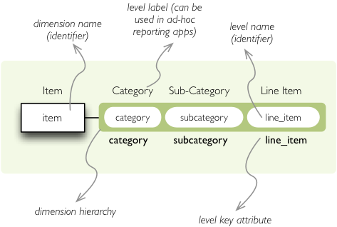
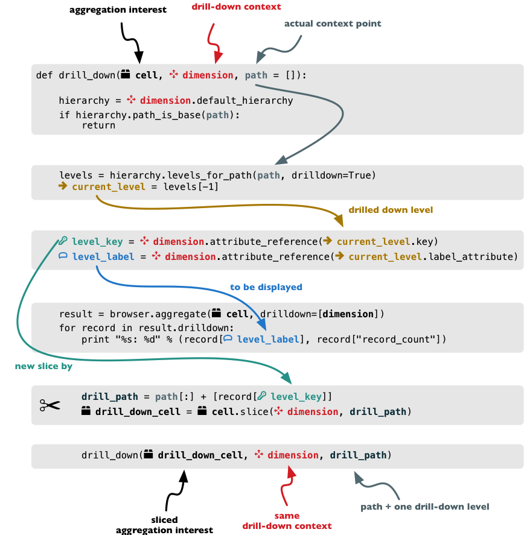
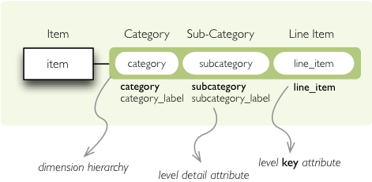

Aggregations and Aggregation Browsing
+++++++++++++++++++++++++++++++++++++

The main purpose of the Cubes framework is aggregation and browsing through the 
aggregates. In this chapter we are going to demonstrate how basic aggregation 
is done.

.. note::

    See the :mod:`backend` documentation for reference.

ROLAP with SQL backend
======================

Following examples will show:

* how to build a model programatically
* how to create a model with flat dimensions
* how to aggregate whole cube
* how to drill-down and aggregate through a dimension

The example data used are `IBRD Balance Sheet`_ taken from `The World Bank`_.
Backend used for the examples is ``sql.browser``.

.. _IBRD Balance Sheet: https://raw.github.com/Stiivi/cubes/master/tutorial/data/IBRD_Balance_Sheet__FY2010.csv
.. _The World Bank: https://finances.worldbank.org/Accounting-and-Control/IBRD-Balance-Sheet-FY2010/e8yz-96c6)

Create a tutorial directory and download :download:`this example file 
<files/IBRD_Balance_Sheet__FY2010.csv>`.

Start with imports:

.. code-block:: python

    import cubes
    import cubes.tutorial.sql as tutorial
    import sqlalchemy

Cubes comes with tutorial helper methods in ``cubes.tutorial``. It is advised 
not to use them in production, they are provided just to simplify learner's 
life.

Prepare the data using the tutorial helpers. This will create a table and
populate it with contents of the CSV file:

.. code-block:: python

    engine = sqlalchemy.create_engine('sqlite:///:memory:')
    tutorial.create_table_from_csv(engine, 
                          "IBRD_Balance_Sheet__FY2010.csv", 
                          table_name="irbd_balance", 
                          fields=[
                                ("category", "string"), 
                                ("line_item", "string"),
                                ("year", "integer"), 
                                ("amount", "integer")],
                          create_id=True    
                            )

We need a :doc:`logical model</model>` - instance of :class:`cubes.model.Model`:

.. code-block:: python

    model = cubes.Model()

Add :class:`dimensions<cubes.model.Dimension>` to the model. Reason for having 
dimensions in a model is, that they might be shared by multiple cubes.

.. code-block:: python

    model.add_dimension(cubes.Dimension("category"))
    model.add_dimension(cubes.Dimension("line_item"))
    model.add_dimension(cubes.Dimension("year"))

Define a :class:`cube<cubes.Cube>` and specify already defined dimensions:

.. code-block:: python

    cube = cubes.Cube(name="irbd_balance", 
                      model=model,
                      dimensions=["category", "line_item", "year"],
                      measures=["amount"]
                      )

Create a :class:`browser<cubes.AggregationBrowser>` instance (in this example 
it is :class:`SQL backend<cubes.backends.sql.SQLBrowser>` implementation) and
get a :class:`cell<cubes.Cell>` representing the whole cube (all data):

.. code-block:: python

    browser = cubes.backends.sql.SQLBrowser(cube, engine.connect(),
                                            view_name = "irbd_balance")

    cell = browser.full_cube()

Compute the aggregate. Measure fields of :class:`aggregation result<cubes.AggregationResult>` have aggregation suffix, currenlty only ``_sum``. Also a total record count within the cell is included as ``record_count``.

.. code-block:: python

    result = browser.aggregate(cell)

    print "Record count: %d" % result.summary["record_count"]
    print "Total amount: %d" % result.summary["amount_sum"]

Now try some drill-down by `category` dimension:

.. code-block:: python

    result = browser.aggregate(cell, drilldown=["category"])

    print "%-20s%10s%10s" % ("Category", "Count", "Total")

    for record in result.drilldown:
        print "%-20s%10d%10d" % (record["category"], record["record_count"], 
                                            record["amount_sum"])

Drill-dow by year:

.. code-block:: python

    result = browser.aggregate(cell, drilldown=["year"])
    print "%-20s%10s%10s" % ("Year", "Count", "Total")
    for record in result.drilldown:
        print "%-20s%10d%10d" % (record["year"], record["record_count"],
                                            record["amount_sum"])

Hierarchies, levels and drilling-down
=====================================

* how to create a hierarchical dimension
* how to do drill-down through a hierarchy
* detailed level description

We are going to use very similar data as in the previous examples. Difference 
is in two added columns: category code and sub-category code. They are simple 
letter codes for the categories and subcategories. Download :download:`this 
example file <files/IBRD_Balance_Sheet__FY2010.csv>`.

Hierarchy
---------

Some :class:`dimensions<cubes.model.Dimension>` can have multiple 
:class:`levels<cubes.model.Level>` forming a 
:class:`hierarchy<cubes.model.Hierarchy>`. For example dates have year, month, 
day; geography has country, region, city; product might have category, 
subcategory and the product.

.. note:

    Cubes supports multiple hierarchies, for example for date you might have 
    year-month-day or year-quarter-month-day. Most dimensions will have one 
    hierarchy, though.

In our example we have the `item` dimension with three levels of hierarchy: 
*category*, *subcategory* and *line item*:

    `Item` dimension hierarchy.

The levels are defined in the model:

.. code-block:: javascript

    "levels": [
        {
            "name":"category",
            "label":"Category",
            "attributes": ["category"]
        },
        {
            "name":"subcategory",
            "label":"Sub-category",
            "attributes": ["subcategory"]
        },
        {
            "name":"line_item",
            "label":"Line Item",
            "attributes": ["line_item"]
        }
    ]

.. comment:

    FIXME: the following paragraph is referencing some "previous one", that is
    something from second tutorial blog post.

You can see a slight difference between this model description and the previous 
one: we didn't just specify level names and didn't let cubes to fill-in the 
defaults. Here we used explicit description of each level. `name` is level 
identifier, `label` is human-readable label of the level that can be used in 
end-user applications and `attributes` is list of attributes that belong to the 
level. The first attribute, if not specified otherwise, is the key attribute of 
the level.

Other level description attributes are `key` and `label_attribute``. The `key` 
specifies attribute name which contains key for the level. Key is an id number, 
code or anything that uniquely identifies the dimension level. 
`label_attribute` is name of an attribute that contains human-readable value 
that can be displayed in user-interface elements such as tables or charts.

Preparation
-----------

.. comment:

    FIXME: include the data loading code here

Again, in short we need:

* data in a database
* logical model (see :download:`model file<files/model_03.json>`) prepared with 
  appropriate mappings
* denormalized view for aggregated browsing (for current simple SQL browser 
  implementation)

Drill-down
----------

Drill-down is an action that will provide more details about data. Drilling 
down through a dimension hierarchy will expand next level of the dimension. It 
can be compared to browsing through your directory structure.

We create a function that will recursively traverse a dimension hierarchy and 
will print-out aggregations (count of records in this example) at the actual 
browsed location.

**Attributes**

* cell - cube cell to drill-down
* dimension - dimension to be traversed through all levels
* path - current path of the `dimension`

Path is list of dimension points (keys) at each level. It is like file-system 
path.

.. code-block:: python

    def drill_down(cell, dimension, path = []):

Get dimension's default hierarchy. Cubes supports multiple hierarchies, for 
example for date you might have year-month-day or year-quarter-month-day. Most 
dimensions will have one hierarchy, thought.

.. code-block:: python

    hierarchy = dimension.hierarchy()

*Base path* is path to the most detailed element, to the leaf of a tree, to the 
fact. Can we go deeper in the hierarchy?

.. code-block:: python

    if hierarchy.path_is_base(path):
        return

Get the next level in the hierarchy. `levels_for_path` returns list of levels 
according to provided path. When `drilldown` is set to `True` then one more 
level is returned.

.. code-block:: python

    levels = hierarchy.levels_for_path(path,drilldown=True)
    current_level = levels[-1]

We need to know name of the level key attribute which contains a path 
component. If the model does not explicitly specify key attribute for the 
level, then first attribute will be used:

.. code-block:: python

    level_key = dimension.attribute_reference(current_level.key)

For prettier display, we get name of attribute which contains label to be 
displayed for the current level. If there is no label attribute, then key 
attribute is used.

.. code-block:: python

    level_label = dimension.attribute_reference(current_level.label_attribute)

We do the aggregation of the cell... 

.. note::

    Shell analogy: Think of ``ls $CELL`` command in commandline, where 
    ``$CELL`` is a directory name. In this function we can think of ``$CELL`` 
    to be same as current working directory (``pwd``)

.. code-block:: python

    result = browser.aggregate(cell, drilldown=[dimension])

    for record in result.drilldown:
        print "%s%s: %d" % (indent, record[level_label], record["record_count"])
        ...

And now the drill-down magic. First, construct new path by key attribute value 
appended to the current path:

.. code-block:: python

        drill_path = path[:] + [record[level_key]]

Then get a new cell slice for current path:

.. code-block:: python

        drill_down_cell = cell.slice(dimension, drill_path)

And do recursive drill-down:

.. code-block:: python

        drill_down(drill_down_cell, dimension, drill_path)

The whole recursive drill down function looks like this:

    Recursive drill-down explained

Whole working example can be found in the ``tutorial`` sources.

Get the full cube (or any part of the cube you like):

.. code-block:: python

    cell = browser.full_cube()

And do the drill-down through the item dimension:

.. code-block:: python

    drill_down(cell, cube.dimension("item"))

The output should look like this::

    a: 32
        da: 8
            Borrowings: 2
            Client operations: 2
            Investments: 2
            Other: 2
        dfb: 4
            Currencies subject to restriction: 2
            Unrestricted currencies: 2
        i: 2
            Trading: 2
        lo: 2
            Net loans outstanding: 2
        nn: 2
            Nonnegotiable, nonintrest-bearing demand obligations on account of subscribed capital: 2
        oa: 6
            Assets under retirement benefit plans: 2
            Miscellaneous: 2
            Premises and equipment (net): 2

Note that because we have changed our source data, we see level codes instead 
of level names. We will fix that later. Now focus on the drill-down.

See that nice hierarchy tree?

Now if you slice the cell through year 2010 and do the exact same drill-down:

.. code-block:: python

    cell = cell.slice("year", [2010])
    drill_down(cell, cube.dimension("item"))

you will get similar tree, but only for year 2010 (obviously).

Level Labels and Details
------------------------

Codes and ids are good for machines and programmers, they are short, might 
follow some scheme, easy to handle in scripts. Report users have no much use of 
them, as they look cryptic and have no meaning for the first sight.

Our source data contains two columns for category and for subcategory: column 
with code and column with label for user interfaces. Both columns belong to the 
same dimension and to the same level. The key column is used by the analytical 
system to refer to the dimension point and the label is just decoration.

Levels can have any number of detail attributes. The detail attributes have no 
analytical meaning and are just ignored during aggregations. If you want to do 
analysis based on an attribute, make it a separate dimension instead.

So now we fix our model by specifying detail attributes for the levels:

    Attribute details.

The model description is:

.. code-block:: javascript

    "levels": [
            {
                "name":"category",
                "label":"Category",
                "label_attribute": "category_label",
                "attributes": ["category", "category_label"]
            },
            {
                "name":"subcategory",
                "label":"Sub-category",
                "label_attribute": "subcategory_label",
                "attributes": ["subcategory", "subcategory_label"]
            },
            {
                "name":"line_item",
                "label":"Line Item",
                "attributes": ["line_item"]
            }
        ]
    }

Note the `label_attribute` keys. They specify which attribute contains label to 
be displayed. Key attribute is by-default the first attribute in the list. If 
one wants to use some other attribute it can be specified in `key_attribute`.

Because we added two new attributes, we have to add mappings for them:

.. code-block:: javascript

    "mappings": { "item.line_item": "line_item",
                  "item.subcategory": "subcategory",
                  "item.subcategory_label": "subcategory_label",
                  "item.category": "category",
                  "item.category_label": "category_label" 
                 }

Now the result will be with labels instead of codes::

    Assets: 32
        Derivative Assets: 8
            Borrowings: 2
            Client operations: 2
            Investments: 2
            Other: 2
        Due from Banks: 4
            Currencies subject to restriction: 2
            Unrestricted currencies: 2
        Investments: 2
            Trading: 2
        Loans Outstanding: 2
            Net loans outstanding: 2
        Nonnegotiable: 2
            Nonnegotiable, nonintrest-bearing demand obligations on account of subscribed capital: 2
        Other Assets: 6
            Assets under retirement benefit plans: 2
            Miscellaneous: 2
            Premises and equipment (net): 2

Implicit hierarchy
------------------

Try to remove the last level *line_item* from the model file and see what 
happens. Code still works, but displays only two levels. What does that mean? 
If metadata - logical model - is used properly in an application, then 
application can handle most of the model changes without any application 
modifications. That is, if you add new level or remove a level, there is no 
need to change your reporting application.

Summary
-------

* hierarchies can have multiple levels
* a hierarchy level is identifier by a key attribute
* a hierarchy level can have multiple detail attributes and there is one 
  special detail attribute: label attribute used for display in user interfaces

    
