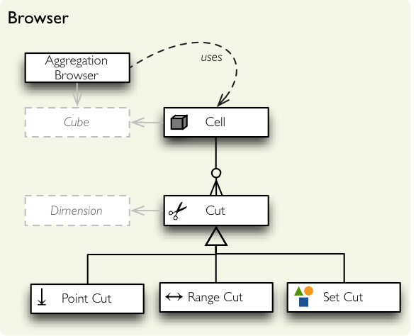

*****************************
Aggregation Browser Reference
*****************************

Abstraction for aggregated browsing (concrete implementation is provided by
one of the backends in package :mod:`backend` or a custom backend).

    Browser package classes.

Aggregate browsing
==================

.. autoclass:: cubes.AggregationBrowser
    :members:

Result
------

The result of aggregated browsing is returned as object:

.. autoclass:: cubes.AggregationResult
    :members:

Slicing and Dicing
==================

.. autoclass:: cubes.Cell
    :members:

Cuts
----

.. autoclass:: cubes.PointCut
    :members:

.. autoclass:: cubes.RangeCut
    :members:

.. autoclass:: cubes.SetCut
    :members:

String conversions
------------------

In applications where slicing and dicing can be specified in form of a string, such as arguments of HTTP requests of an web application, there are couple helper methods that do the string-to-object conversion:

.. autofunction:: cubes.cuts_from_string

.. autofunction:: cubes.string_from_cuts

.. autofunction:: cubes.string_from_path

.. autofunction:: cubes.path_from_string

.. autofunction:: cubes.coalesce_drilldown

Mapper
------

.. autoclass:: cubes.Mapper
.. autoclass:: cubes.SnowflakeMapper
.. autoclass:: cubes.DenormalizedMapper
