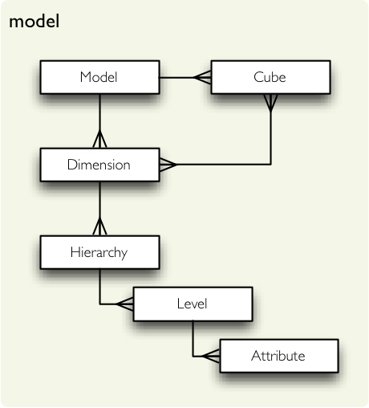

******************************
:mod:`model` --- Logical Model
******************************

.. module:: model
   :synopsis: logical model representation, cube descriptions, dimensions

:mod:`model` is a package that provides Cubes meta-data objects and functionality for working with them. :doc:`../model`
   

    The logical model classes.

   
Loading or creating a model
===========================

.. autofunction:: cubes.load_model
.. autofunction:: cubes.create_model
.. autofunction:: cubes.create_cube
.. autofunction:: cubes.create_dimension
.. autofunction:: cubes.create_level

Simple Models
-------------

There might be cases where one would like to analyse simple (denormalised)
table. It can be either a table in a database or data from a single CSV file.
For convenience, there is an utility function called `simple_model` that will
create a model with just one cube, simple dimensions and couple of specified
measures.

.. autofunction:: cubes.simple_model

Model components
================

Model
-----

.. autoclass:: cubes.Model

Cube
----

.. autoclass:: cubes.Cube

Dimension, Hierarchy, Level
---------------------------

.. autoclass:: cubes.Dimension

.. autoclass:: cubes.Hierarchy

.. autoclass:: cubes.Level

.. autoclass:: cubes.Attribute

Helper function to coalesce list of attributes, which can be provided as strings or as Attribute objects:

.. autofunction:: cubes.attribute_list

.. exception:: ModelError

   Exception raised when there is an error with model and its structure, mostly 
   during model construction.

.. exception:: ModelIncosistencyError

    Raised when there is incosistency in model structure, mostly when model
    was created programatically in a wrong way by mismatching classes or
    misonfiguration.

.. exception:: NoSuchDimensionError

    Raised when a dimension is requested that does not exist in the model.

.. exception:: NoSuchAttributeError

    Raised when an unknown attribute, measure or detail requested.

