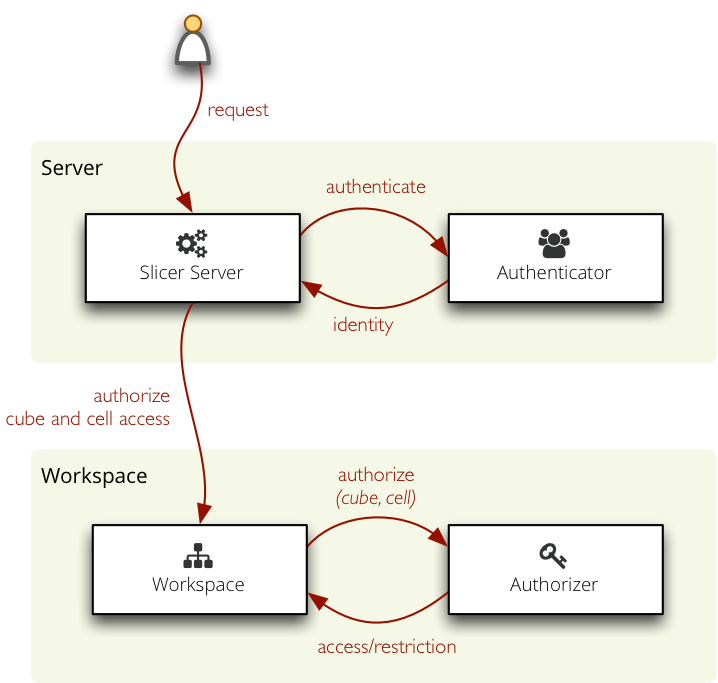

################################
Authorization and Authentication
################################

Cubes provides simple but extensible mechanism for authorization through an
`Authorizer` and for authentication through an `Authenticator`.

Authentication in cubes: determining and confirirming the user's identity, for
example using a user name and password, some secret key or using an external
service.

Authorization: providing (or denying) access to cubes based on user's
identity.

    Overview of authorization and authentication process in Slicer

Authorization
=============

The authorization principle in cubes is based on user's rights to a cube and
restriction within a cube. If user has a "right to a cube" he can access the
cube, the cube will be visible to him.

Restriction within a cube is cell based: users might have access only to a
certain cell within a cube. For example a shop manager might have access only
to sales cube and dimension point equal to his own shop.

Authorization is configured at the workspace level. In ``slicer.ini`` it is
specified as:

.. code-block:: ini

    [workspace]
    authorization: simple

    [authorization]
    rights_file: access_rights.json

There is only one build-in authorizer called ``simple``.

Simple Authorization
--------------------

Simple authorization based on JSON files: `rights` and `roles`. The `rights`
file contains a dictionary with keys as user identities (user names, API keys,
...) and values as right descriptions.

The user right is described as:

* ``roles`` – list of of user's role – user inherits the restrictions from the
  role
* ``allowed_cubes`` – list of cubes that the user can access (and no other
  cubes)
* ``denied_cubes`` – list of cubes that the user can not access (he can access
  the rest of cubes)
* ``cube_restrictions`` – a dictionary where keys are cube names and values
  are lists of cuts

The roles file has the same structure as the rights file, instead of users it
defines inheritable roles. The roles can inherit properties from other roles.

Example of roles file:

.. code-block:: javascript

    {
        "retail": {
            "allowed_cubes": ["sales"]
        }
    }

Rights file:

.. code-block:: javascript

    {
        "martin": {
            "roles": ["retail"],
        }
    }

The rights file of the simple authorization method might contain a special
guest role which will be used when no other identity is found. See the
configuration documentation for more information.

Authentication
==============

Authentication is handled at the server level.

Built-in authentication methods:

* ``none`` – no authentication
* ``pass_parameter`` – permissive authentication that just passes an URL parameter
  to the authorizer. Default parameter name is ``api_key``
* ``http_basic_proxy`` – permissive authentication using HTTP Basic method.
  Assumes that the slicer is behind a proxy and that the password was already
  verified. Passes the user name to the authorizer.

