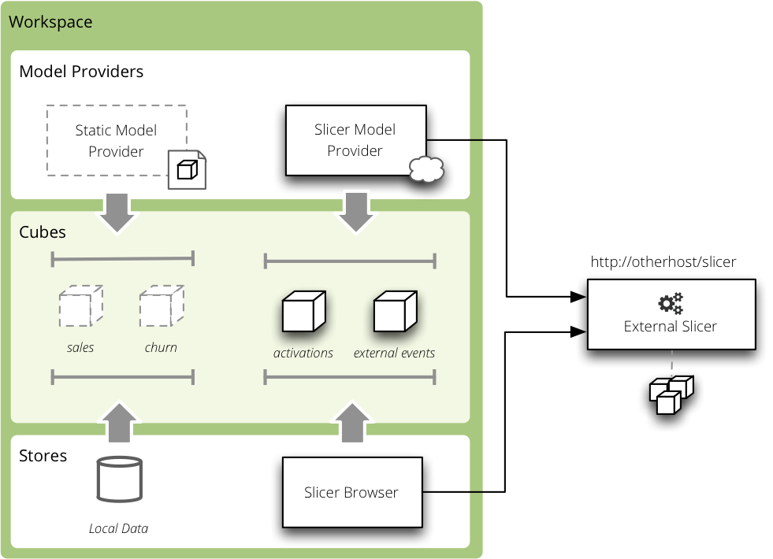

#############
Slicer Server
#############

It is possible to plug-in cubes from other slicer servers using the Slicer
Server backend.

    Slicer backend 

Store Configuration and Model
=============================

Type is ``slicer``

* ``url`` – Slicer URL
* ``authentication`` – authentication method of the source server (supported
  only ``none`` and ``pass_parameter``)
* ``auth_identity`` – authentication identity (or API key) for
  ``pass_parameter`` authentication.

Example::

    [datastore]
    type: slicer
    url: http://slicer.databrewery.org/webshop-example

For more than one slicer define one datastore per source Slicer server.

Model
-----

Slicer backend generates the model on-the-fly from the source server. You have
to specify that the provider is ``slicer``:

.. code-block:: javascript

    {
        "provider": "slicer"
    }

For more than one slicer, create one file per source Slicer server and specify
the data store:

.. code-block:: javascript

    {
        "provider": "slicer",
        "datastore": "slicer_2"
    }

Example
=======

Create a ``model.json``:

.. code-block:: json

    {
        "provider": "slicer"
    }

Create a ``slicer.ini``:

.. code-block:: ini

    [workspace]
    model: slicer_model.json

    [datastore]
    type: slicer
    url: http://slicer.databrewery.org/webshop-example

    [server]
    prettyprint: true

Run the server:

.. code-block:: sh

    slicer serve slicer.ini

Get a list of cubes:

.. codeb-block:: sh

    curl "http://localhost:5000/cubes"

