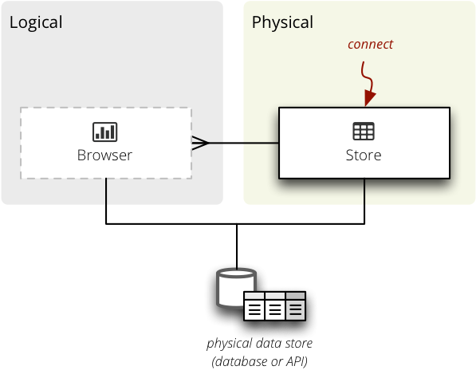
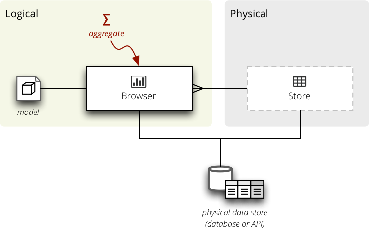

********
Backends
********

Two objects play major role in Cubes backends:

* `aggregation browser` – responsible for aggregations, fact listing,
  dimension member listing
* `store` – represents a database connection, shared by multiple browsers

.. seealso::

    :doc:`plugins`

Store
=====

Data for cubes are provided by a `data store` – every cube has one.  Stores
have to be subclasses of `Store` for cubes to be able to find them.

    Backend data store.

Required methods:

* `__init__(**options)` – initialize the store with `options`. Even if you use
  named arguments, you have to include the `**options`.
* `close()` – release all resources associated with the store, close database
  connections
* `default_browser_name` – a class variable with browser name that will be
  created for a cube, if not specified otherwise

A `Store` class:

.. code-block:: python

    from cubes import Store

    class MyStore(Store):
        default_browser_name = "my"

        def __init__(self, **options):
            super(MyStore, self).__init__(**options)
            # configure the store here ...

.. note::

    The custom store has to be a subclass of `Store` so Cubes can find it. The
    name will be derived from the class name: `MyStore` will become `my`,
    `AnotherSQLStore` will become `another_sql`. To explicitly specify a store
    name, set the `__extension_name__` class variable.

Configuration
-------------

The store is configured from a `slicer.ini` file. The store instance receives
all options from it's configuration file section as arguments to the
`__init__()` method.

It is highly recommended that the store provides a class variable named
`__options__` which is a list of parameter description dictionaries. The list
is used for properly configuring the store from end-user tools, such as
Slicer. It also provides information about how to convert options into
appropriate data types. Example:

.. code-block:: python

    class MyStore(Store):
        default_browser_name = "my"

        __options__ = [
            {
                "name": "collection",
                "type": "string",
                "description": "Name of data collection"
            },
            {
                "name": "unfold",
                "type": "bool",
                "description": "Unfold nested structures"
            }
        }

        def __init__(self, collection=None, unfold=Flase, **options):
            super(MyStore, self).__init__(**options)

            self.collection = collection
            self.unfold = unfold

An example configuration for this store would look like:

.. code-block:: ini

    [store]
    type: my
    collection: data
    unfold: true

Aggregation Browser
===================

Browser retrieves data from a `store` and works in a context of a `cube` and
`locale`.

    Backend data store.

Methods to be implemented:

* `__init__(cube, store, locale)` – initialize the browser for `cube` stored
  in a `store` and use model and data `locale`.
* `features()` – return a dictionary with browser's features
* `aggregate()`, `facts()`, `fact()`, `members()` – all basic browser actions
  that take a cell as first argument. See :class:`AggregationBrowser` for more
  information.

For example:

.. code-block:: python

    class SnowflakeBrowser(AggregationBrowser):

        def __init__(self, cube, store, locale=None, **options):
            super(SnowflakeBrowser, self).__init__(cube, store, locale)
            # browser initialization...

Name of the example store will be ``snowflake``. To explicitly set the browser
name set the `__extension_name__` class property:

.. code-block:: python

    class SnowflakeBrowser(AggregationBrowser):
        __extension_name__ = "sql"

In this case, the browser will be known by the name ``sql``.

.. note::

    The current `AggregationBrowser` API towards the extension development is
    provisional and will verylikely change. The change will mostly involve
    removal of requirements for preparation of arguments and return value.

Aggregate
---------

Implement the `provide_aggregate()` method with the following arguments:

* `cell` – cube cell to be aggregated, alwas a :class:`cubes.Cell` instance
* `aggregates` – list of aggregates to be considered 
* `drilldown` – :class:`cubes.Drilldown` instance (already prepared)
* `split` (optional browser feature) – virtual cell-based dimension to split
  the aggregation cell into two: within the split cell or outside of the split
  cell. Can be either `None` or a :class:`cubes.Cell` instance
* `page`, `page_size` – page number and size of the page for paginated results
* `order` – order specification: list of two-item tuples (`attribute`,
  `order`)

.. code-block:: python

    def provide_aggregate(self, cell, aggregates, drilldown, split, order,
                          page, page_size, **options):

        #
        # ... do the aggregation here ...
        #

        result = AggregationResult(cell=cell, aggregates=aggregates)

        # Set the result cells iterator (required)
        result.cells = ...
        result.labels = ...

        # Optional:
        result.total_cell_count = ...
        result.summary = ...

        return result

.. note::

    Don't override the `aggregate()` method – it takes care of proper argument
    conversions and set-up.

.. seealso::

    :class:`cubes.AggregationResult`, :class:`cubes.Drilldown`,
    :class:`cubes.Cell`

Facts
-----

.. code-block:: python

    def facts(self, cell=None, fields=None, order=None, page=None,
              page_size=None):

        cell = cell or Cell(self.cube)
        attributes = self.cube.get_attributes(fields)
        order = self.prepare_order(order, is_aggregate=False)

        #
        # ... fetch the facts here ...
        #
        # facts = ... an iterable ...
        #

        result = Facts(facts, attributes)

        return result

Browser and Cube Features
-------------------------

The browser features for all or a particuliar cube (if there are differences)
are returned by the :meth:`cubes.AggregationBrowser.features` method. The
method is expected to return at least one key in the dictionary: ``actions``
with list of browser actions that the browser supports.

Browser actions are: ``aggregate``, ``fact``, ``facts``, ``members`` and
``cell``.

Optional but recommended is setting the list of ``aggregate_functions`` –
functions for measures computed in the browser's engine. The other is
``post_aggregate_functions`` – list of fucntions used as post-aggregation
outside of the browser.

Configuration
-------------

The browser is configured by merging:

* model's `options` property
* cube's `options` property
* store's configuration options (from ``slicer.ini``)

The browser instance receives the options as parameters to the `__init__()`
method.
