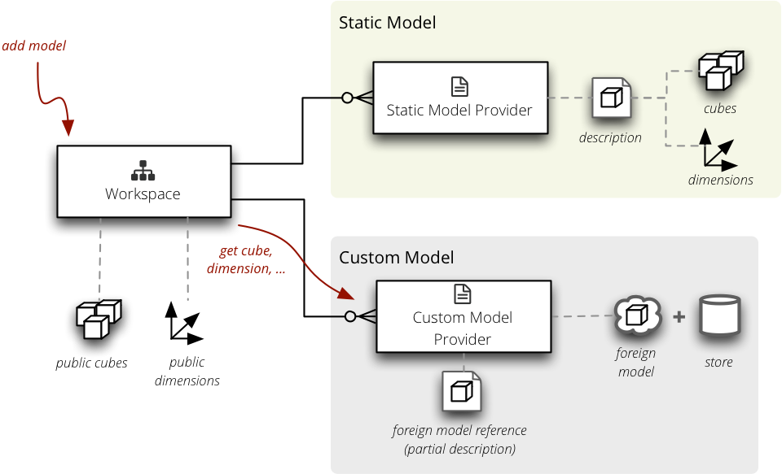

***************
Model Providers
***************

Model providers create :class:`cubes.Cube` and :class:`cubes.Dimension`
objects from a metadata or an external description.

    Context of Model Providers.

To implement a custom model provider subclass the :class:`cubes.ModelProvider`
class. It is required that the `__init__` method calls the super's `__init__`
with the `metadata` argument.

Required methods to be implemented:

* `list_cubes()` – return a list of cubes that the provider provides. Return
  value should be a dictionary with keys: ``name``, ``label``, ``description``
  and ``info``.
* `cube(name)` – return a :class:`cubes.Cube` object
* `dimension(name, dimensions)` – return a :class:`cubes.Dimension` object.
  `dimensions` is a dictionary of public dimensions that can be used as
  templates. If a template is missing the method should raise
  `TemplateRequired(template)` error.

Optional:

* `requires_store()` – return `True` in this method if the provider requires a
  data store (database connection, API credentials, ...). 

.. seealso::

   :doc:`../reference/model`, 
   :doc:`../reference/providers`,
   :class:`cubes.ModelProvider`,
   :class:`cubes.StaticModelProvider`,
   :func:`cubes.create_cube`,
   :func:`cubes.create_dimension`

Cube
----

To provide a cube implement `cube(name)` method. The method should raise
`NoSuchCubeError` when a cube is not provided by the provider.

To set cube's dimension you can either set dimension's name in
`linked_dimensions` or directly a `Dimension` object in `dimensions`. The rule
is:

* `linked_dimensions` – shared dimensions, might be defined in external model,
  might be even own dimension that is considered public
* `dimensions` – private dimensions, dimensions with public name conflicts

.. note::

    It is recommended to use the `linked_dimensions` name list. The
    `dimensions` is considered an advanced feature.

Example of a provider which provides just a simple cube with date dimension
and a measure `amount` and two aggregates `amount_sum` and `record_count`.
Knows three cubes: `activations`, `churn` and `sales`:

.. code-block:: python

    from cubes import ModelProvider, create_cube

    class SimpleModelProvider(ModelProvider):
        def __init__(self, metadata=None):
            super(DatabaseModelProvider, self).__init__(metadata)

            self.known_cubes = ["activations", "churn", "sales"]

        def list_cubes(self):

            cubes = []
            for name in self.known_cubes:
                info = {"name": name}
                cubes.append(info)

            return cubes

        def cube(self, name):
            if not name in self.known_cubes:
                raise NoSuchCubeError("Unknown cube '%s'" % name, name)
           
            metadata = {
                "name": name,
                "linked_dimensions": ["date"],
                "measures": ["amount"],
                "aggregats": [
                    {"name": "amount_sum", "measure": "amount", "function": "sum"},
                    {"name": "record_count", "function": "count"}
                ]
            }

            return create_cube(metadata) 

The above provider assumes that some other object providers the `date`
dimension.

Store
-----

Some providers might require a database connection or an API credentials that
might be shared by the data store containing the actual cube data. In this
case the model provider should implement method `requires_store()` and return
``True``. The provider's `initialize_from_store()` will be called back at some
point before first cube is retrieved. The provider will have `store` instance
variable available with :class:`cubes.Store` object instance.

Example:

.. code-block:: python

    from cubes import ModelProvider, create_cube
    from sqlalchemy import sql
    import json

    class DatabaseModelProvider(ModelProvider):
        def requires_store(self):
            return True

        def initialize_from_store(self):
            self.table = self.store.table("cubes_metadata")
            self.engine = self.store.engine

        def cube(self, name):
            self.engine.execute(select)

            # Let's assume that we have a SQLalchemy table with a JSON string
            # with cube metadata and columns: name, metadata

            condition = self.table.c.name == name

            statement = sql.expression.select(self.table.c.metadata,
                                              from_obj=self.table,
                                              where=condition)

            result = list(self.engine.execute(statement))

            if not result:
                raise NoSuchCubeError("Unknown cube '%s'" % name, name)

            cube = json.loads(result[0])

            return create_cube(cube)

.. seealso::

    :doc:`plugins`
