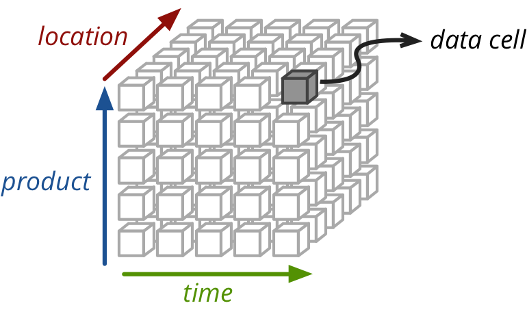
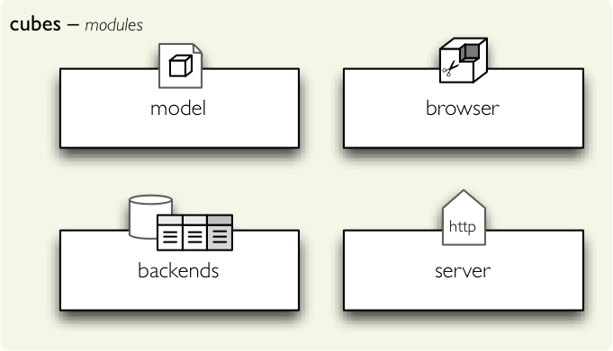

++++++++++++
Introduction
++++++++++++

Why cubes?
==========

*Focus on data analysis, in human way*

Purpose is to provide a framework for giving analyst or any application 
end-user understandable and natural way of presenting the multidimensional 
data. One of the main features is the logical model, which serves as 
abstraction over physical data to provide end-user layer.

It is meant to be used by application builders that want to provide analytical
functionality.

Features:

* logical view of analysed data - how analysts look at data, how they think of 
  data, not not how the data are physically implemented in the data stores
* hierarchical dimensions (attributes that have hierarchical dependencies, such 
  as category-subcategory or country-region)
* localizable metadata and data (see :doc:`localization`)

* OLAP and aggregated browsing (default backend is for relational databse - 
  ROLAP)
* multidimensional analysis

Cube, Dimensions, Facts and Measures
====================================

The framework thiks of the data as a cube with multiple dimensions:

    a data cube
    
The most detailed unit of the data is a *fact*. Fact can be a contract, 
invoice, spending, task, etc. Each fact might have a *measure* – an attribute 
that can be measured, such as: price, amount, revenue, duration, tax, discount, 
etc.

The *dimension* provides context for facts. Is used to:

* filter queries or reporst
* controls scope of aggregation of facts
* used for ordering or sorting
* defines master-detail relationship

Dimension can have multiple *hierarchies*, for example the date dimension might 
have year, month and day levels in a hierarchy.

Architecture
============

The framework is composed of four modules and one command-line tool:

* :mod:`model` - Description of data (*metadata*): dimensions, hierarchies, 
  attributes, labels, localizations.
* :mod:`browser` - Aggregation browsing, slicing-and-dicing, drill-down.
* :mod:`backends` - Actual aggregation implementation and utility functions.
* :mod:`server` - WSGI HTTP server for Cubes
* :doc:`slicer` - command-line tool

    framework modules

Model
-----

Logical model describes the data from user’s or analyst’s perspective: data how 
they are being measured, aggregated and reported. Model is independent of 
physical implementation of data. This physical independence makes it easier to 
focus on data instead on ways of how to get the data in understandable form.

More information about logical model can be found in the chapter :doc:`model`. 
See also programming reference of the :mod:`model` module.

Browser
-------

Core of the Cubes analytics functionality is the aggregation browser. The 
browser module contains utility classes and functions for the 
browser to work.

More information about browser can be found in the chapter :doc:`aggregate`. 
See also programming reference of the :mod:`browser` module.

Backends
--------

Backends provide the actual data aggregation and browsing functionality. Cubes 
comes with built-in `ROLAP`_ backend which uses SQL database through 
`SQLAlchemy`_.

Framework has modular nature and supports multiple database backends, therefore 
different ways of cube computation and ways of browsing aggregated data.

See also programming reference of the :mod:`backends` module.

.. _ROLAP: http://en.wikipedia.org/wiki/ROLAP
.. _SQLAlchemy: http://www.sqlalchemy.org/download.html

Server
------

Cubes comes with built-in WSGI HTTP OLAP server called :doc:`slicer` and 
provides json API for most of the cubes framework functionality. The server is 
based on the Werkzeug WSGI framework.

More information about the Slicer server requests can be found in the chapter 
:doc:`server`. See also programming reference of the :mod:`server` module.
