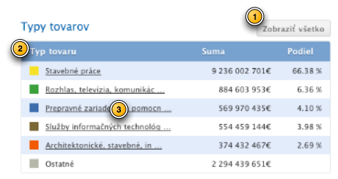
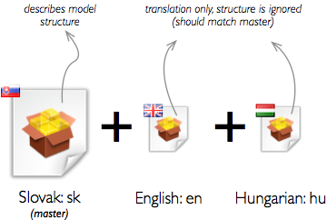

Localization
============

Having origin in multi-lingual Europe one of the main features of the Cubes
framework is ability to provide localizable results. There are three levels of
localization in each analytical application:

1. Application level - such as buttons or menus
2. Metadata level - such as table header labels
3. Data level - table contents, such as names of categories or procurement types

    Localization levels.

The application level is out of scope of this framework and is covered in
internationalization (i18n) libraries, such as `gettext`. What is covered in
Cubes is metadata and data level.

Localization in cubes is very simple:

1. Create master model definition and specify locale the model is in
2. Specify attributes that are localized (see :ref:`PhysicalAttributeMappings`)
3. Create model translations for each required language
4. Make cubes function or a tool create translated versions the master model

To create localized report, just specify locale to the browser and create
reports as if the model was not localized. See :ref:`LocalizedReporting`.

Metadata Localization
---------------------

The metadata are used to display report labels or provide attribute
descriptions. Localizable metadata are mostly ``label`` and ``description``
metadata attributes, such as dimension label or attribute description.

Say we have three locales: Slovak, English, Hungarian with Slovak being the
main language. The master model is described using Slovak language and we have
to provide two model translation specifications: one for English and another
for Hungarian.

The model translation file has the same structure as model definition file,
but everything except localizable metadata attributes is ignored. That is,
only ``label`` and ``description`` keys are considered in most cases. You can
not change structure of mode in translation file. If structure does not match
you will get warning or error, depending on structure change severity.

There is one major difference between master model file and model
translations: all attribute lists, such as cube measures, cube details or
dimension level attributes are dictionaries, not arrays. Keys are attribute
names, values are metadata translations. Therefore in master model file you
will have::

    attributes = [
                    { "name": "name", "label": "Name" },
                    { "name": "cat", "label": "Category" }
                 ]

in translation file you will have::

    attributes = {
                    "name": {"label": "Meno"},
                    "cat": {"label": "Kategoria"}
                 }

If a translation of a metadata attribute is missing, then the one in master
model description is used.

In our case we have following files::

    procurements.json
    procurements_en.json
    procurements_hu.json

    Localization master model and translation files.

To load a model:

.. code-block:: python

    import cubes
    model_sk = cubes.load_model("procurements.json", translations = { 
                                    "en": "procurements_en.json",
                                    "hu": "procurements_hu.json",
                                    })

To get translated version of a model:

.. code-block:: python

    model_en = model.translate("en")
    model_hu = model.translate("hu")

Or you can get translated version of the model by directly passing translation dictionary:

.. code-block:: python

    handle = open("procurements_en.json")
    trans = json.load(handle)
    handle.close()
    
    model_en = model.translate("en", trans)

Data Localization
-----------------

If you have attributes that needs to be localized, specify the locales (languages) in the attribute
definition in :ref:`PhysicalAttributeMappings`.

.. note::

    Data localization is implemented only for Relational/SQL backend.

.. _LocalizedReporting:

Localized Reporting
-------------------

Main point of localized reporting is: *Create query once, reuse for any
language*. Provide translated model and desired locale to the aggregation
browser and you are set. The browser takes care of appropriate value
selection.

Aggregating, drilling, getting list of facts - all methods return localized
data based on locale provided to the browser. If you want to get multiple
languages at the same time, you have to create one browser for each language
you are reporting.
