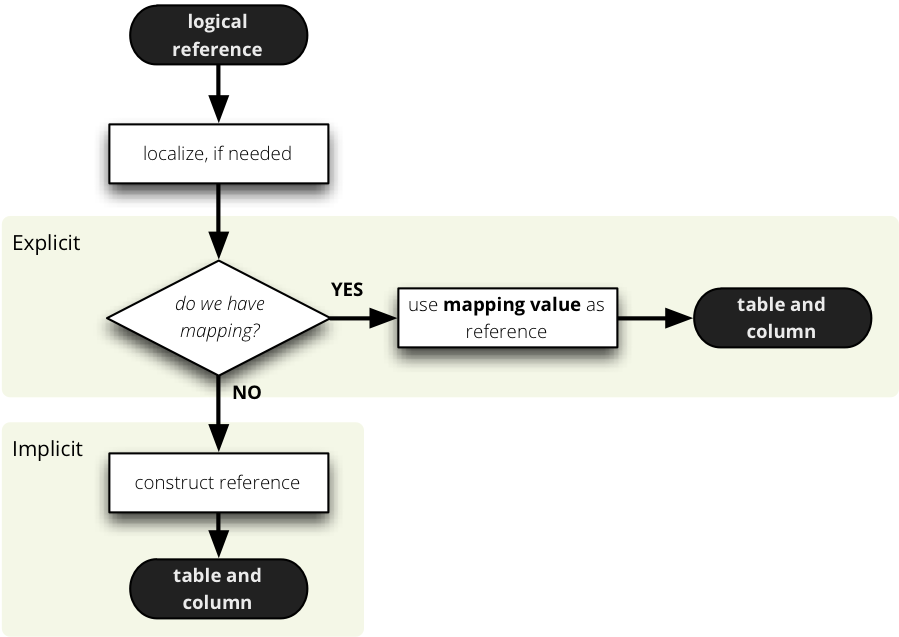
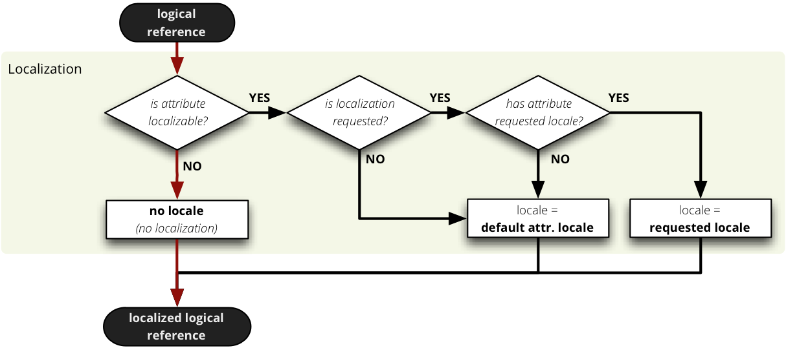
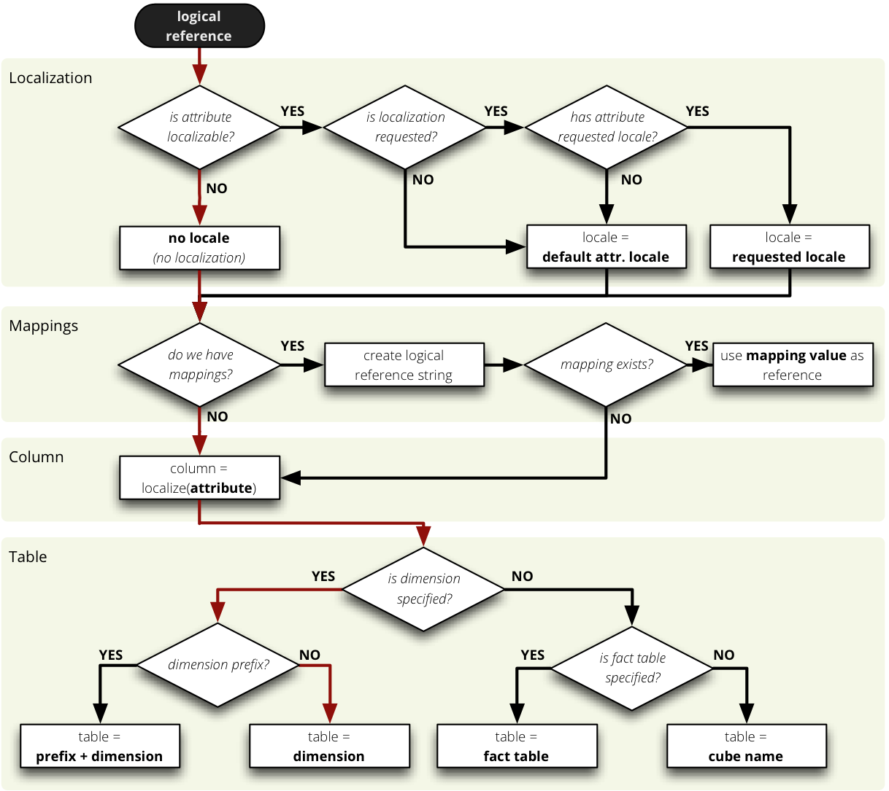
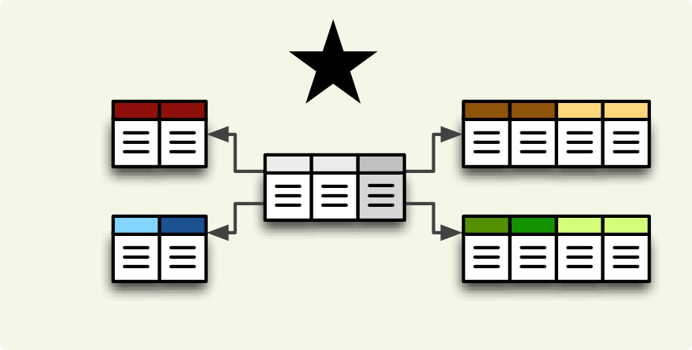
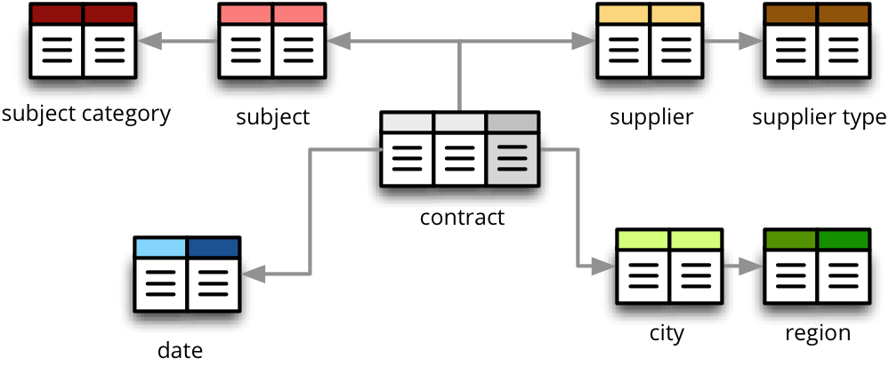
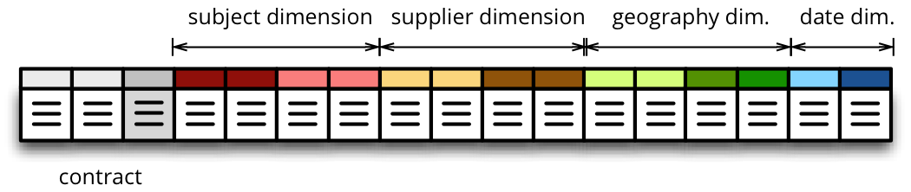
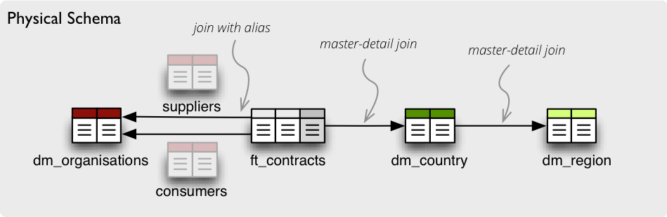

+++++++++++++++++++++++++++++++++
Logical to Physical Model Mapping
+++++++++++++++++++++++++++++++++

One of the most important parts of proper OLAP on top of the relational
database is the mapping of logical attributes to their physical counterparts.
In SQL database the physical attribute is stored in a column, which belongs to
a table, which might be part of a database schema.

.. note:: 

    StarBrowser (SQL) is used as an example.
    
.. note::

    Despite this chapter describes examples mostly in the relational database
    backend, the principles are the same, or very similar, in other backends
    as well.

For example, take a reference to an attribute *name* in a dimension *product*.
What is the column of what table in which schema that contains the value of
this dimension attribute?

.. figure:: images/mapping-example1.png
    :align: center
    :width: 400px

For data browsing, the Cubes framework has to know where those logical
(reported) attributes are physically stored. It needs to know which tables are
related to the cube and how they are joined together so we get whole view of a
fact.

The process is done in two steps:

1. joining all star/snowflake tables
2. mapping logical attribute to table + column

Mapping
=======

There are two ways how the mapping is being done: *implicit* and *explicit*.
The simplest, straightforward and most customizable is the explicit way, where
the actual column reference is provided in a mapping dictionary of the cube
description.

`Mapping dictionary` is a dictionary of logical attributes as keys and
physical attributes (columns, fields) as values. The logical attributes
references look like:

* `dimensions_name.attribute_name`, for example: ``geography.country_name`` or 
  ``category.code``
* `fact_attribute_name`, for example: ``amount`` or ``discount``

For example:

.. code-block:: javascript

    "mappings": {
        "product.name": "dm_products.product_name"
    }

If it is in different schema or any part of the reference contains a dot:

.. code-block:: javascript

    "mappings": {
        "product.name": {
                "schema": "sales",
                "table": "dm_products",
                "column": "product_name"
            }
    }

Disadvantage of the explicit way is it's verbosity and the fact that developer
has to write more metadata, obviously.

Both, explicit and implicit mappings have ability to specify default database
schema (if you are using Oracle, PostgreSQL or any other DB which supports
schemas).

The mapping process process is like this:

    
.. note::

    In other than SQL backends, the value in the mapping dictionary can be
    interpreted differently. The (`schema`, `table`, `column`) tuple is
    used as an example from SQL browser.

Implicit Mapping
----------------

With implicit mapping one can match a database schema with logical model and
does not have to specify additional mapping metadata. Expected structure is
star schema with one table per (denormalized) dimension.

Basic rules:

* fact table should have same name as represented cube
* dimension table should have same name as the represented dimension, for
  example: `product` (singular)
* references without dimension name in them are expected to be in the fact
  table, for example: `amount`, `discount` (see note below for simple flat
  dimensions)
* column name should have same name as dimension attribute: `name`, `code`,
  `description`
* if attribute is localized, then there should be one column per localization
  and should have locale suffix: `description_en`, `description_sk`,
  `description_fr` (see below for more information)

This means, that by default `product.name` is mapped to the table `product`
and column `name`. Measure `amount` is mapped to the table `sales` and column
`amount`

What about dimensions that have only one attribute, like one would not have a
full date but just a `year`? In this case it is kept in the fact table without
need of separate dimension table. The attribute is treated in by the same rule
as measure and is referenced by simple `year`. This is applied to all
dimensions that have only one attribute (representing key as well). This
dimension is referred to as *flat and without details*.

Note for advanced users: this behavior can be disabled by setting
``simplify_dimension_references`` to ``False`` in the mapper. In that case you
will have to have separate table for the dimension attribute and you will have
to reference the attribute by full name. This might be useful when you know
that your dimension will be more detailed.

.. note::

    In other than SQL backends, the implicit mapping might be implemented
    differently. Refer to the respective backend documentation to learn how
    the mapping is done.

.. _PhysicalAttributeMappings:

Localization
------------

Despite localization taking place first in the mapping process, we talk about
it at the end, as it might be not so commonly used feature. From physical
point of view, the data localization is very trivial and requires language
denormalization - that means that each language has to have its own column for
each attribute.

Localizable attributes are those attributes that have ``locales`` specified in
their definition. To map logical attributes which are localizable, use locale
suffix for each locale. For example attribute `name` in dimension `category`
has two locales: Slovak (``sk``) and English (``en``). Or for example product
category can be in English, Slovak or German. It is specified in the model
like this:

.. code-block:: javascript

    attributes = [
        {
            "name" = "category",
            "locales" = ["en", "sk", "de"]
        }
    ]

During the mapping process, localized logical reference is created first:

In short: if attribute is localizable and locale is requested, then locale
suffix is added. If no such localization exists then default locale is used.
Nothing happens to non-localizable attributes.

For such attribute, three columns should exist in the physical model. There
are two ways how the columns should be named. They should have attribute name
with locale suffix such as ``category_sk`` and ``category_en`` (_underscore_
because it is more common in table column names), if implicit mapping is used.
You can name the columns as you like, but you have to provide explicit mapping
in the mapping dictionary. The key for the localized logical attribute should
have ``.locale`` suffix, such as ``product.category.sk`` for Slovak version of
category attribute of dimension product. Here the _dot_ is used because dots
separate logical reference parts.

.. note::

    Current implementation of Cubes framework requires a star or snowflake
    schema that can be joined into fully denormalized normalized form just by
    simple one-key based joins. Therefore all localized attributes have to be
    stored in their own columns. In other words, you have to denormalize the
    localized data before using them in Cubes.

Read more about :doc:`localization`.

Customization of the Implicit
-----------------------------

The implicit mapping process has a little bit of customization as well:

* `dimension_table_prefix`: you can specify what prefix will be used for all
  dimension tables. For example if the prefix is ``dim_`` and attribute is
  `product.name` then the table is going to be ``dim_product``.
* `fact_table_prefix`: used for constructing fact table name from cube name.
  Example: having prefix ``ft_`` all fact attributes of cube `sales` are going
  to be looked up in table ``ft_sales``
* `fact_table_name`: one can explicitly specify fact table name for each cube
  separately
  
See also: :class:`cubes.backends.sql.mapper.SnowflakeMapper`

Mapping Process Summary
-----------------------

Following diagram describes how the mapping of logical to physical attributes
is done in the star SQL browser (see :class:`cubes.backends.sql.StarBrowser`):

    logical to physical attribute mapping

The "red path" shows the most common scenario where defaults are used.

Joins
=====

Star browser supports a star:

and snowflake database schema:

.. figure:: images/schema_snowflake.png
    :align: center
    :width: 300px

If you are using either of the two schemas (star or snowflake) in relational
database, Cubes requires information on how to join the tables. Tables are
joined by matching single-column – surrogate keys. The framework needs the
join information to be able to transform following snowflake:

to appear as this (denormalized table) with all cube attributes:

Join
----

The single join description consists of reference to the `master` table and a 
table with `details`. Fact table is example of master table, dimension is 
example of a detail table (in star schema).

.. note::

    As mentioned before, only single column – surrogate keys are supported for
    joins.

The join specification is very simple, you define column reference for both:
master and detail. The table reference is in the form `table`.`column`:

.. code-block:: javascript

    "joins" = [
        {
            "master": "fact_sales.product_key",
            "detail": "dim_product.key"
        }
    ]

As in mappings, if you have specific needs for explicitly mentioning database
schema or any other reason where `table.column` reference is not enough, you
might write:

.. code-block:: javascript

    "joins" = [
        { 
            "master": "fact_sales.product_id",
            "detail": {
                "schema": "sales",
                "table": "dim_products",
                "column": "id"
            }
    ]

Aliases
-------

What if you need to join same table twice or more times? For example, you have
list of organizations and you want to use it as both: supplier and service
consumer.

It can be done by specifying alias in the joins:

.. code-block:: javascript

    "joins" = [
        {
            "master": "contracts.supplier_id", 
            "detail": "organisations.id",
            "alias": "suppliers"
        },
        {
            "master": "contracts.consumer_id", 
            "detail": "organisations.id",
            "alias": "consumers"
        }
    ]

Note that with aliases, in the mappings you refer to the table by alias
specified in the joins, not by real table name. So after aliasing tables with
previous join specification, the mapping should look like:

.. code-block:: javascript

    "mappings": {
        "supplier.name": "suppliers.org_name",
        "consumer.name": "consumers.org_name"
    }

For example, we have a fact table named ``fact_contracts`` and dimension table 
with categories named ``dm_categories``. To join them we define following join 
specification:

.. code-block:: javascript

    "joins" = [
        {
            "master": "fact_contracts.category_id",
            "detail": "dm_categories.id"
         }
    ]

Original (Old) Browser
======================

The original default browser was a little bit limited. The differences are:

* no support for custom schema - everything had to be in a single schema
* flat dimension attributes were always simplified, and sometimes incorrectly
* normalization was required for browsing

