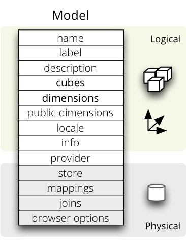
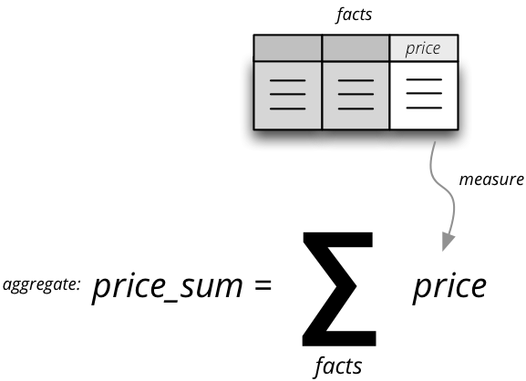

**************************
Logical Model and Metadata
**************************

Logical model describes the data from user's or analyst's perspective: data
how they are being measured, aggregated and reported. Model is independent of
physical implementation of data. This physical independence makes it easier to
focus on data instead on ways of how to get the data in understandable form.

.. seealso::

    :doc:`schemas`
        Example database schemas and their respective models.

    :doc:`reference/model`
        Reference of model classes and functions.

    `Cubes Models <https://github.com/DataBrewery/cubes-models>`_
        Repository of basic cubes models.

Introduction
============

The logical model enables users to:

* see the data from the business perspective
* hide physical structure of the data ("how application's use it")
* specify concept hierarchies of attributes, such as:
    * `product category > product > subcategory > product`
    * `country > region > county > town`.
* provide more descriptive attribute labels for display in the applications or
  reports
* transparent localization of metadata and data

Analysts or report writers do not have to know where name of an organisation
or category is stored, nor he does not have to care whether customer data is
stored in single table or spread across multiple tables (customer, customer
types, ...). They just ask for `customer.name` or `category.code`.

In addition to abstraction over physical model, localization abstraction is
included. When working in multi-lingual environment, only one version of
report/query has to be written, locales can be switched as desired. If
requesting "contract type name", analyst just writes `contract_type.name` and
Cubes framework takes care about appropriate localisation of the value.

Example: Analysts wants to report contract amounts by geography which has two
levels: country level and region level. In original physical database, the
geography information is normalised and stored in two separate tables, one for
countries and another for regions. Analyst does not have to know where the
data are stored, he just queries for `geography.country` and/or
`geography.region` and will get the proper data. How it is done is depicted on
the following image:

.. figure:: logical-to-physical.png
    :align: center
    :width: 500px

    Mapping from logical model to physical data.

The logical model describes dimensions `geography` in which default hierarchy
has two levels: `country` and `region`. Each level can have more attributes,
such as code, name, population... In our example report we are interested only
in geographical names, that is: `country.name` and `region.name`.

.. How the physical attributes are located is described in the :doc:`mapping`
.. chapter.

Model
=====

The logical model is described using `model metadata dictionary`. The content
is description of logical objects, physical storage and other additional
information.

    Logical model metadata

Logical part of the model description:

* ``name`` – model name
* ``label`` – human readable model label *(optional)*
* ``description`` – human readable description of the model *(optional)*
* ``locale`` – locale the model metadata are written in *(optional, used for
  localizable models)*
* ``cubes`` – list of cubes metadata (see below)
* ``dimensions`` – list of dimension metadata (see below)

Physical part of the model description:

* ``store`` – name of the datastore where model's cubes are stored. Default is
  ``default``. See :doc:`workspace` for more information.
* ``mappings`` - backend-specific logical to physical mapping
  dictionary. This dictionary is inherited by every cube in the model.
* ``joins`` - backend-specific join specification (used for example in
  the SQL backend). It should be a list of dictionaries. This list is
  inherited by the cubes in the model.
* ``browser_options`` – options passed to the browser. The options are merged
  with options in the cubes.

Example model snippet:

.. code-block:: javascript

    {
    	"name": "public_procurements",
    	"label": "Public Procurements of Slovakia",
    	"description": "Contracts of public procurement winners in Slovakia"
    	"cubes": [...]
    	"dimensions": [...]
    }

Mappings and Joins
------------------

One can specify shared mappings and joins on the model-level. Those mappings
and joins are inherited by all the cubes in the model.

The ``mappings`` dictionary of a cube is merged with model's global mapping
dictionary. Cube's values overwrite the model's values.

The ``joins`` can be considered as named templates. They should contain
``name`` property that will be referenced by a cube.

Visibility: The joins and mappings are local to a single model. They are not
shared within
the workspace.

Inheritance
~~~~~~~~~~~

.. TODO: move this into recipes

Cubes in a model will inherit mappings and joins from the model. The mappings
are merged in a way that cube's mappings replace existing model's
mappings with the same name. Joins are concatenated or merged by their name.

Example from the SQL backend: Say you would like to join a date dimension
table in ``dim_date`` to every cube. Then you specify the join at the model
level as:

.. code-block:: json

    "joins": [
        {
            "name": "date",
            "detail": "dim_date.date_id",
            "method": "match"
        }
    ]

The join has a name specified, which is used to match joins in the cube. Note
that the join contains incomplete information: it contains only the ``detail``
part, that is the dimension key. To use the join in a cube which has two date
dimensions `start date` and `end date`:

.. code-block:: json

    "joins": [
        {
            "name": "date",
            "master": "fact_contract.contract_start_date_id",
        },
        {
            "name": "date",
            "master": "fact_sales.contract_sign_date_id",
        }
    ]

The model's joins are searched for a template with given name and then cube
completes (or even replaces) the join information.

For more information about mappings and joins refer to the :doc:`backend
documentation<backends/index>` for your data store, such as
:doc:`SQL<backends/sql>`

File Representation
-------------------

The model can be represented either as a JSON file or as a directory with JSON
files. The single-file model specification is just a dictionary with model
properties. The model directory bundle should have the following content:

* ``model.json`` – model's master metadata – same as single-file model
* ``dim_*.json`` – dimension metadata file – single dimension dictionary
* ``cube_*.json`` – cube metadata – single cube dictionary

The list of dimensions and cubes in the ``model.json`` are merged with the
dimensions and cubes in the separate files. Avoid duplicate definitions.

Example directory bundle model::

    model.cubesmodel/
        model.json
        dim_date.json
        dim_organization.json
        dim_category.json
        cube_contracts.json
        cube_events.json

Model Provider and External Models
----------------------------------

If the model is provided from an external source, such as an API or a
database, then name of the provider should be specified in ``provider``.

The provider receives the model's metadata and the model's data store (if the
provider so desires). Then the provider generates all the cubes and the
dimensions.

Example of a model that is provided from an external source
(:doc:`Mixpanel<backends/mixpanel>`):

.. code-block:: javascript

    {
    	"name": "Events",
    	"provider": "mixpanel"
    }

.. note::

    The `cubes` and `dimensions` in the generated model are just informative
    for the model provider. The provider can yield different set of cubes and
    dimensions as specified in the metadata.

.. seealso::

    :func:`cubes.ModelProvider`
        Load a model from a file or a URL.

    :func:`cubes.StaticModelProvider`
        Create model from a dictionary.

Dimension Visibility
--------------------

All dimensions from a static (file) model are shared in the workspace by
default. That means that the dimensions can be reused freely among cubes from
different models.

One can define a master model with dimensions only and no cubes. Then define
one model per cube category, datamart or any other categorization. The models
can share the master model dimensions.

To expose only certain dimensions from a model specify a list of dimension
names in the ``public_dimensions`` model property. Only dimensions from the
list can be shared by other cubes in the workspace.

.. note::

    Some backends, such as Mixpanel, don't share dimensions at all.

Cubes
=====

Cube descriptions are stored as a dictionary for key ``cubes`` in the model
description dictionary or in json files with prefix ``cube_`` like
``cube_contracts``.

.. list-table::
    :widths: 1 5
    :header-rows: 1

    * - Key
      - Description
    * - **Basic**
      -
    * - ``name`` *
      - Cube name, unique identifier. Required.
    * - ``label``
      - Human readable name - can be used in an application
    * - ``description``
      - Longer human-readable description of the cube *(optional)*
    * - ``info``
      - Custom info, such as formatting. Not used by cubes framework.
    * - ``dimensions`` *
      - List of dimension names or dimension links (recommended, but might be
        empty for dimension-less cubes). Recommended.
    * - ``measures``
      - List of cube measures (recommended, but might be empty for
        measure-less, record count only cubes). Recommended.
    * - ``aggregates``
      - List of aggregated measures. Required, if no measures are specified.
    * - ``details``
      - List of fact details (as Attributes) - attributes that are not
        relevant to aggregation, but are nice-to-have when displaying facts
        (might be separately stored)
    * - **Physical**
      -
    * - ``joins``
      - Specification of physical table joins (required for star/snowflake
        schema)
    * - ``mappings``
      - Mapping of logical attributes to physical attributes
    * - ``key``
      - Fact key field or column name. If not specified, backends might either
        refuse to generate facts or might use some default column name such as
        ``id``.
    * - ``fact``
      - Fact table, collection or source name – interpreted by the backend.
        The fact table does not have to be specified, as most of the backends
        will derive the name from the cube's name.
    * - **Advanced**
      -
    * - ``browser_options``
      - Browser specific options, consult the backend for more information
    * - ``store``
      - Name of a datastore where the cube is stored. Use this only when
        default store assignment is different from your requirements.

Fields marked with * are required.

Example:

.. code-block:: javascript

    {
        "name": "sales",
        "label": "Sales",
        "dimensions": [ "date", ... ]

    	"measures": [...],
    	"aggregates": [...],
    	"details": [...],

    	"fact": "fact_table_name",
    	"mappings": { ... },
    	"joins": [ ... ]
    }

.. note::

    The ``key`` might be required by some backends, such as SQL, to be able to
    generate detailed facts or to get a single fact. Please refer to the
    backend's documentation for more information.

.. _measures-and-aggregates:

Measures and Aggregates
-----------------------

    Measure and measure aggregate

`Measures` are numerical properties of a fact. They might be represented, for
example, as a table column. Measures are aggregated into measure aggregates.
The measure is described as:

* ``name`` – measure identifier (required)
* ``label`` – human readable name to be displayed (localized)
* ``info`` – additional custom information (unspecified)
* ``aggregates`` – list of aggregate functions that are provided for this
  measure. This property is for generating default aggregates automatically.
  It is highly recommended to list the aggregates explicitly and avoid using
  this property.
* ``window_size`` – number of elements within a window for window functions
  such as moving average. If not provided and function requires it then 1 (one
  element) is assumed.

..
    * ``nonadditive`` – can be `all` (non-additive for any dimension), `time`
      (non-additive for time dimension, for example account balance) or `none`
      (default, fully additive)

.. ``formula`` – name of formula
.. ``expression`` – arithmetic expression

Example:

.. code-block:: javascript

    "measures": [
        {
            "name": "amount",
            "label": "Sales Amount"
        },
        {
            "name": "vat",
            "label": "VAT"
        }
    ]

`Measure aggregate` is a value computed by aggregating measures over facts.
It's properties are:

* ``name`` – aggregate identifier, such as: `amount_sum`, `price_avg`,
  `total`, `record_count`
* ``label`` – human readable label to be displayed (localized)
* ``measure`` – measure the aggregate is derived from, if it exists or it is
  known. Might be empty.
* ``function`` - name of an aggregate function applied to the `measure`, if
  known. For example: `sum`, `min`, `max`.
* ``window_size`` – number of elements within a window for window functions
  such as moving average. If not provided and function requires it then 1 (one
  element) is assumed.
* ``info`` – additional custom information (unspecified)
* ``expression`` - to be used instead of ``function``, this allows you to use
  simple, SQL-like expressions to calculate the value of an aggregate based on
  attributes of the fact. Alternatively, remind that fields can also be
  calculated at database level if your database system supports views.

Example:

.. code-block:: javascript

    "aggregates": [
        {
            "name": "amount_sum",
            "label": "Total Sales Amount",
            "measure": "amount",
            "function": "sum"
        },
        {
            "name": "vat_sum",
            "label": "Total VAT",
            "measure": "vat",
            "function": "sum"
        },
        {
            "name": "sales_minus_tax",
            "label": "Sales less VAT",
            "expression": "sum(amount) - sum(vat)"
        },
        {
            "name": "item_count",
            "label": "Item Count",
            "function": "count"
        }

    ]

Note the last aggregate ``item_count`` – it counts number of the facts within
a cell. No measure required as a source for the aggregate.

If no aggregates are specified, Cubes generates default aggregates from the
measures. For a measure:

.. code-block:: javascript

    "measures": [
        {
            "name": "amount",
            "aggregates": ["sum", "min", "max"]
        }
    ]

The following aggregates are created:

.. code-block:: javascript

    "aggregates" = [
        {
            "name": "amount_sum",
            "measure": "amount",
            "function": "sum"
        },
        {
            "name": "amount_min",
            "measure": "amount",
            "function": "min"
        },
        {
            "name": "amount_max",
            "measure": "amount",
            "function": "max"
        }
    ]

If there is a list of aggregates already specified in the cube explicitly,
both lists are merged together.

.. note::

    To prevent automated creation of default aggregates from measures, there
    is an advanced cube option ``implicit_aggregates``. Set this property to
    `False` if you want to keep only explicit list of aggregates.

In previous version of Cubes there was omnipresent measure aggregate
called ``record_count``. It is no longer provided by default and has to be
explicitly defined in the model. The name can be of any choice, it is not
a built-in aggregate anymore. To keep the original behavior, the following
aggregate should be added:

.. code-block:: javascript

    "aggregates": [
        {
            "name": "record_count",
            "function": "count"
        }
    ]

.. note::

    Some aggregates do not have to be computed from measures. They might be
    already provided by the data store as computed aggregate values (for
    example Mixpanel's `total`). In this case the `measure` and `function`
    serves only for the backend or for informational purposes.  Consult the
    backend documentation for more information about the aggregates and
    measures.

.. seealso::

   :class:`cubes.Cube`
        Cube class reference.

   :class:`cubes.Measure`
        Measure class reference.

   :class:`cubes.MeasureAggregate`
        Measure Aggregate class reference.

Customized Dimension Linking
----------------------------

It is possible to specify how dimensions are linked to the cube. The
``dimensions`` list might contain, besides dimension names, also a
specification how the dimension is going to be used in the cube's context. The
specification might contain:

* ``hierarchies`` – list of hierarchies that are relevant for the cube. For
  example the `date` dimension might be defined as having `day` granularity,
  but some cubes might be only at the `month` level.  To specify only relevant
  hierarchies use ``hierarchies`` metadata property:
* ``exclude_hierarchies`` – hierarchies to be excluded when cloning the
  original dimension. Use this instead of ``hierarchies`` if you would like to
  preserve most of the hierarchies and remove just a few.
* ``default_hierarchy_name`` – name of default hierarchy for a dimension in
  the context of the cube
* ``cardinality`` – cardinality of the dimension with regards to the cube. For
  example one cube might contain thousands of product types, another might have
  only a few, but they both share the same `products` dimension
* ``alias`` – how the dimension is going to be called in the cube. For
  example, you might have two date dimensions and name them `start_date` and
  `end_date` using the alias

..
    * ``nonadditive`` – nonadditive behavior of the dimension in the cube

Example:

.. code-block:: javascript

    {
        "name": "churn",

        "dimensions": [
            {"name": "date", "hierarchies": ["ym", "yqm"]},
            "customer",
            {"name": "date", "alias": "contract_date"}
        ],

        ...
    }

The above cube will have three dimensions: `date`, `customer` and
`contract_date`. The `date` dimension will have only two hierarchies with
lowest granularity of `month`, the `customer` dimension will be assigned as-is
and the `contract_date` dimension will be the same as the original `date`
dimension.

Dimensions
==========

Dimension descriptions are stored in model dictionary under the key
``dimensions``.

.. figure:: dimension_desc.png

   Dimension description - attributes.

The dimension description contains keys:

.. list-table::
    :widths: 1 5
    :header-rows: 1

    * - Key
      - Description
    * - **Basic**
      -
    * - ``name`` *
      - dimension name, used as identifier
    * - ``label``
      - human readable name - can be used in an application
    * - ``description``
      - longer human-readable description of the dimension *(optional)*
    * - ``info``
      - custom info, such as formatting. Passed to the front-end.
    * - ``levels``
      - list of level descriptions
    * - ``hierarchies``
      - list of dimension hierarchies
    * - ``default_hierarchy_name``
      - name of a hierarchy that will be used as default
    * - **Advanced**
      -
    * - ``cardinality``
      - dimension cardinality (see Level for more info)
    * - ``role``
      - dimension role
    * - ``category``
      - logical category (user oriented metadata)
    * - ``template``
      - name of a dimension that will be used as template

..
    * - ``nonadditive``
      - used when the dimension is nonadditive or semiadditive

Fields marked with * are required.

If no levels are specified, then one default level will be created.

If no hierarchy is specified, then the default hierarchy will contain all
levels of the dimension.

Example:

.. code-block:: javascript

    {
        "name": "date",
        "label": "Dátum",
        "levels": [ ... ]
        "hierarchies": [ ... ]
    }

Use either ``hierarchies`` or ``hierarchy``, using both results in an error.

Dimension Templates
-------------------

If you are creating more dimensions with the same or similar structure, such
as multiple dates or different types of organisational relationships, you
might create a template dimension and then use it as base for the other
dimensions:

.. code-block:: javascript

    "dimensions" = [
        {
            "name": "date",
            "levels": [...]
        },
        {
            "name": "creation_date",
            "template": "date"
        },
        {
            "name": "closing_date",
            "template": "date"
        }
    ]

All properties from the template dimension will be copied to the new
dimension. Properties can be redefined in the new dimension. In that case, the
old value is discarded. You might change levels, hierarchies or default
hierarchy. There is no way how to add or drop a level from the template, all
new levels have to be specified again if they are different than in the
original template dimension. However, you might want to just redefine
hierarchies to omit unnecessary levels.

.. note::

    In mappings name of the new dimension should be used. The template
    dimension was used only to create the new dimension and the connection
    between the new dimension and the template is lost. In our example above,
    if cube uses the `creation_date` and `closing_date` dimensions and any
    mappings would be necessary, then they should be for those two dimensions,
    not for the `date` dimension.

..
    Nonadditive
    -----------

    There are cases where it is not meaningful to add values over certain
    dimension. For example it has no sense to add account balance over time. For
    such dimension the ``nonadditive`` value can be specified:

    * ``all`` – dimension is nonadditive
    * ``time`` – dimension can not be added over dimensions with role `time`
    * ``none`` – dimension is fully additive (same as if no value was specified)

Level
-----

Dimension hierarchy levels are described as:

.. list-table::
    :widths: 1 5
    :header-rows: 1

    * - Key
      - Description
    * - ``name`` *
      - level name, used as identifier
    * - ``label``
      - human readable name - can be used in an application
    * - ``attributes``
      - list of other additional attributes that are related to the level. The
        attributes are not being used for aggregations, they provide
        additional useful information.
    * - ``key``
      - key field of the level (customer number for customer level, region
        code for region level, year-month for month level). key will be used
        as a grouping field for aggregations. Key should be unique within
        level.
    * - ``label_attribute``
      - name of attribute containing label to be displayed (customer name for
        customer level, region name for region level, month name for month
        level)
    * - ``order_attribute``
      - name of attribute that is used for sorting, default is the first
        attribute (key)
    * - ``cardinality``
      - symbolic approximation of the number of level's members
    * - ``role``
      - Level role (see below)
    * - ``info``
      - custom info, such as formatting. Not used by cubes framework.

Fields marked with * are required.

If no attributes are specified then only one attribute is assumed with the
same name as the level.

If no `key` is specified, then first attribute is assumed.

If no `label_attribute` is specified, then second attribute is assumed if
level has more than one attribute, otherwise the first attribute is used.

Example of month level of date dimension:

.. code-block:: javascript

    {
        "name": "month",
        "label": "Mesiac",
        "key": "month",
        "label_attribute": "month_name",
        "attributes": ["month", "month_name", "month_sname"]
    },

Example of supplier level of supplier dimension:

.. code-block:: javascript

    {
        "name": "supplier",
        "label": "Dodávateľ",
        "key": "ico",
        "label_attribute": "name",
        "attributes": ["ico", "name", "address", "date_start", "date_end",
                        "legal_form", "ownership"]
    }

.. seealso::

   :class:`cubes.Dimension`
        Dimension class reference

   :func:`cubes.create_dimension`
        Create a dimension object from a description dictionary.

   :class:`cubes.Level`
        Level class reference

   :func:`cubes.create_level`
        Create level object from a description dictionary.

.. note::

    Level attribute names have to be unique within a dimension that owns the
    level.

Cardinality
~~~~~~~~~~~

The `cardinality` property is used optionally by backends and front-ends for
various purposes. The possible values are:

* ``tiny`` – few values, each value can have it's representation on the
  screen, recommended: up to 5.
* ``low`` – can be used in a list UI element, recommended 5 to 50 (if sorted)
* ``medium`` – UI element is a search/text field, recommended for more than 50
  elements
* ``high`` – backends might refuse to yield results without explicit
  pagination or cut through this level.

Hierarchy
---------

Hierarchies are described as:

================ ================================================================
Key              Description
================ ================================================================
``name``         hierarchy name, used as identifier
``label``        human readable name - can be used in an application
``levels``       ordered list of level names from top to bottom - from least
                 detailed to most detailed (for example: from year to day, from
                 country to city)
================ ================================================================

Required is only `name`.

Example:

.. code-block:: javascript

    "hierarchies": [
        {
            "name": "default",
            "levels": ["year", "month"]
        },
        {
            "name": "ymd",
            "levels": ["year", "month", "day"]
        },
        {
            "name": "yqmd",
            "levels": ["year", "quarter", "month", "day"]
        }
    ]

Attributes
----------

Dimension level attributes can be specified either as rich metadata or just
simply as strings. If only string is specified, then all attribute metadata
will have default values, label will be equal to the attribute name.

.. list-table::
    :widths: 1 5
    :header-rows: 1

    * - Key
      - Description
    * - name
      - attribute name (should be unique within a dimension)
    * - label
      - human readable name - can be used in an application, localizable
    * - order
      - natural order of the attribute (optional), can be ``asc`` or ``desc``
    * - format
      - application specific display format information
    * - missing_value
      - Value to be substituted when there is no value (NULL) in the source
        (backend has to support this feature)
    * - locales
      - list of locales in which the attribute values are available in
        (optional)
    * - info
      - custom info, such as formatting. Not used by cubes framework.

The optional `order` is used in aggregation browsing and reporting. If
specified, then all queries will have results sorted by this field in
specified direction. Level hierarchy is used to order ordered attributes. Only
one ordered attribute should be specified per dimension level, otherwise the
behavior is unpredictable. This natural (or default) order can be later
overridden in reports by explicitly specified another ordering direction or
attribute. Explicit order takes precedence before natural order.

For example, you might want to specify that all dates should be ordered by
default:

.. code-block:: javascript

    "attributes" = [
        {"name" = "year", "order": "asc"}
    ]

Locales is a list of locale names. Say we have a `CPV` dimension (common
procurement vocabulary - EU procurement subject hierarchy) and we are
reporting in Slovak, English and Hungarian. The attributes will be therefore
specified as:

.. code-block:: javascript

    "attributes" = [
        {
            "name" = "group_code"
        },
        {
            "name" = "group_name",
            "order": "asc",
            "locales" = ["sk", "en", "hu"]
        }
    ]

`group name` is localized, but `group code` is not. Also you can see that the
result will always be sorted by `group name` alphabetical in ascending order.

In reports you do not specify locale for each localized attribute, you specify
locale for whole report or browsing session. Report queries remain the same
for all languages.

Roles
-----

Some dimensions and levels might have special, but well known, roles. One
example of a role is `time`. There might be more recognized roles in the future,
for example `geography`.

Front-ends that respect roles might provide different user interface elements,
such as date and time pickers for selecting values of a date/time dimension.
For the date picker to work, the front-end has to know, which dimension
represents date and which levels of the dimension represent calendar units
such as year, month or day.

The role of a dimension has to be explicitly stated. Front-ends are not
required to assume a dimension named `date` is really a full date dimension.

The level roles do not have to be mentioned explicitly, if the level name
can be recognized to match a particuliar role. For example, in a dimension
with role `time` level with name `year` will have automatically role `year`.

Level roles have to be specified when level names are in different language or
for any reason don't match english calendar unit names.

Currently there is only one recognized dimension role: ``time``. Recognized
level roles with their default assignment by level name are: ``year``,
``quarter``, ``month``, ``day``, ``hour``, ``minute``, ``second``, ``week``,
``weeknum``, ``dow``, ``isoyear``, ``isoweek``, ``isoweekday``.

The key value of level with role ``week`` is expected to have format
``YYYY-MM-DD``.

