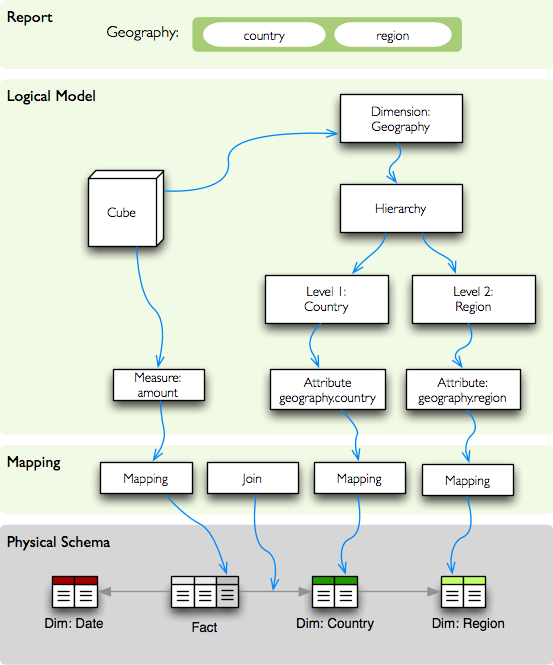
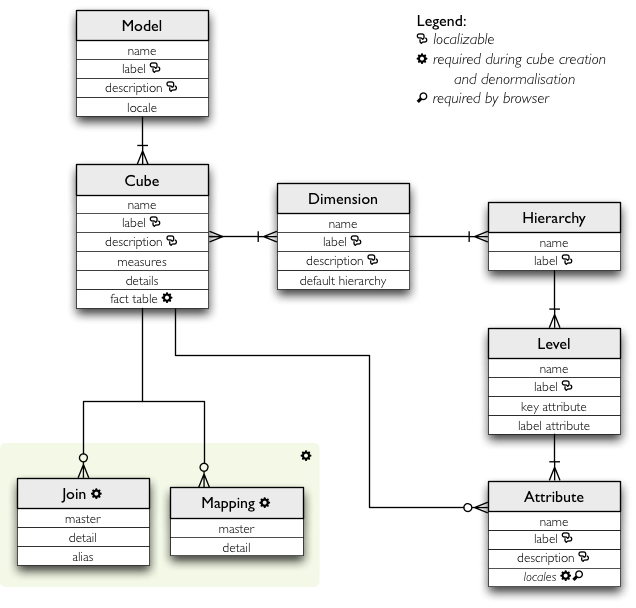
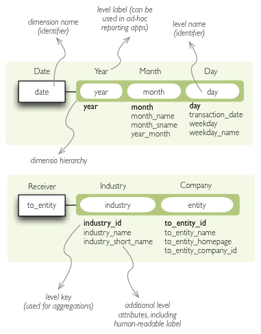

**************************
Logical Model and Metadata
**************************

Logical model describes the data from user's or analyst's perspective: data
how they are being measured, aggregated and reported. Model is independent of
physical implementation of data. This physical independence makes it easier to
focus on data instead on ways of how to get the data in understandable form.
Objects and functionality for working with metadata are provided by the
:mod:`model` package.

In short, logical model enables users to:

* refer to dimension attributes by name regardless of storage (which table)
* specify hierarchical dependencies of attributes, such as:
    * `product category > product > subcategory > product`
    * `country > region > county > town`.
* specify attribute labels to be displayed in end-user application
* for all localizations use the same attribute name, therefore write only one 
  query for all report translations

Analysts or report writers do not have to know where name of an organisation
or category is stored, nor he does not have to care whether customer data is
stored in single table or spread across multiple tables (customer, customer
types, ...). They just ask for `customer.name` or `category.code`.

In addition to abstraction over physical model, localization abstraction is
included. When working in multi-lingual environment, only one version of
report/query has to be written, locales can be switched as desired. If
requesting "contract type name", analyst just writes `constract_type.name` and
Cubes framework takes care about appropriate localisation of the value.

Example: Analysts wants to report contract amounts by geography which has two
levels: country level and region level. In original physical database, the
geography information is normalised and stored in two separate tables, one for
countries and another for regions. Analyst does not have to know where the
data are stored, he just queries for `geography.country` and/or
`geography.region` and will get the proper data. How it is done is depicted on
the following image:

    Mapping from logical model to physical data.

The logical model describes dimensions `geography` in which default hierarchy
has two levels: `country` and `region`. Each level can have more attributes,
such as code, name, population... In our example report we are interested only
in geographical names, that is: `country.name` and `region.name`.

.. How the physical attributes are located is described in the :doc:`mapping` 
.. chapter.

Logical Model description
=========================

The logical model can be either constructed programmatically or provided as
JSON. The model entities and their structure are depicted on the following
figure:

    The logical model entities and relationships.

Load a model::

    model = cubes.load_model(path)

The ``path`` might be:

* JSON file with a dictionary describing model
* URL with a JSON dictionary
* a directory with logical model description files (model, cubes, dimensions) - note that this is
  the old way of specifying model and is being depreciated

Model can be represented also as a single json file containing all model objects. 

The directory contains:

========================== =============================================
File                       Description
========================== =============================================
model.json                 Core model information
cube_*cube_name*.json      Cube description, one file per cube
dim_*dimension_name*.json  Dimension description, one file per dimension
========================== =============================================

Model
-----

The `model` dictionary contains main model description. The structure is::

    {
    	"name": "public_procurements",
    	"label": "Public Procurements of Slovakia",
    	"description": "Contracts of public procurement winners in Slovakia"
    	"cubes": [...]
    	"dimensions": [...]
    }

============== ===================================================
Key            Description
============== ===================================================
**cubes**      list of cube descriptions
**dimensions** list of dimension descriptions
name           model name *(optional)*
label          human readable name - can be used in an application
               *(optional)*
description    longer human-readable description of the model
               *(optional)*
============== ===================================================

Cubes
-----

Cube descriptions are stored as a dictionary for key ``cubes`` in the model
description dictionary or in json files with prefix ``cube_`` like
``cube_contracts``, or 

============== ====================================================
Key            Description
============== ====================================================
**name**       cube name
**measures**   list of cube measures (recommended, but might be
               empty for measure-less, record count only cubes)
**dimensions** list of cube dimension names (recommended, but might
               be empty for dimension-less cubes)
label          human readable name - can be used in an application
details        list of fact details (as Attributes) - attributes
               that are not relevant to aggregation, but are
               nice-to-have when displaying facts (might be
               separately stored)
joins          specification of physical table joins (required for
               star/snowflake schema)
mappings       :doc:`mapping<mapping>` of logical attributes to
               physical attributes
options        backend/workspace options
info           custom info, such as formatting. Not used by cubes 
               framework.
============== ====================================================

Example::

    {
        "name": "date",
        "label": "Dátum",
        "dimensions": [ "date", ... ]

    	"measures": [...],
    	"details": [...],

    	"fact": "fact_table_name",
    	"mappings": { ... },
    	"joins": [ ... ]
    }

For more information about mappings see :doc:`mapping`

Dimensions
----------

Dimension descriptions are stored in model dictionary under the key
``dimensions``.

   Dimension description - attributes.

The dimension description contains keys:

====================== ===================================================
Key                    Description
====================== ===================================================
**name**               dimension name, used as identifier
label                  human readable name - can be used in an application
levels                 list of level descriptions
hierarchies            list of dimension hierarchies
hierarchy              if dimension has only one hierarchy, you can
                       specify it under this key 
default_hierarchy_name name of a hierarchy that will be used as default
info                   custom info, such as formatting. Not used by cubes 
                       framework.
====================== ===================================================

Example:

.. code-block:: javascript

    {
        "name": "date",
        "label": "Dátum",
        "levels": [ ... ]
        "attributes": [ ... ]
        "hierarchies": [ ... ]
    }

Use either ``hierarchies`` or ``hierarchy``, using both results in an error.

Hierarchy levels are described as:

================ ================================================================
Key              Description
================ ================================================================
name             level name, used as identifier
label            human readable name - can be used in an application
attributes       list of other additional attributes that are related to the
                 level. The attributes are not being used for aggregations, they
                 provide additional useful information.
key              key field of the level (customer number for customer level,
                 region code for region level, year-month for month level). key
                 will be used as a grouping field for aggregations. Key should be
                 unique within level.
label_attribute  name of attribute containing label to be displayed (customer
                 name for customer level, region name for region level,
                 month name for month level)
info             custom info, such as formatting. Not used by cubes 
                 framework.
================ ================================================================

Example of month level of date dimension:

.. code-block:: javascript

    {
        "month",
        "label": "Mesiac",
        "key": "month",
        "label_attribute": "month_name",
        "attributes": ["month", "month_name", "month_sname"]
    },
    
Example of supplier level of supplier dimension:

.. code-block:: javascript

    {
        "name": "supplier",
        "label": "Dodávateľ",
        "key": "ico",
        "label_attribute": "name",
        "attributes": ["ico", "name", "address", "date_start", "date_end",
                        "legal_form", "ownership"]
    }

Hierarchies are described as:

================ ================================================================
Key              Description
================ ================================================================
name             hierarchy name, used as identifier
label            human readable name - can be used in an application
levels           ordered list of level names from top to bottom - from least
                 detailed to most detailed (for example: from year to day, from
                 country to city)
================ ================================================================

Example:

.. code-block:: javascript

    "hierarchies": [
        {
            "name": "default",
            "levels": ["year", "month"]
        },
        {
            "name": "ymd",
            "levels": ["year", "month", "day"]
        },
        {
            "name": "yqmd",
            "levels": ["year", "quarter", "month", "day"]
        }
    ]

Attributes
----------

Measures and dimension level attributes can be specified either as rich
metadata or just simply as strings. If only string is specified, then all
attribute metadata will have default values, label will be equal to the
attribute name.

================ ================================================================
Key              Description
================ ================================================================
name             attribute name (should be unique within a dimension)
label            human readable name - can be used in an application, localizable
order            natural order of the attribute (optional), can be ``asc`` or 
                 ``desc``
locales          list of locales in which the attribute values are available in
                 (optional)
aggregations     list of aggregations to be performed if the attribute is a 
                 measure
info             custom info, such as formatting. Not used by cubes 
                 framework.
================ ================================================================

The optional `order` is used in aggregation browsing and reporting. If
specified, then all queries will have results sorted by this field in
specified direction. Level hierarchy is used to order ordered attributes. Only
one ordered attribute should be specified per dimension level, otherwise the
behavior is unpredictable. This natural (or default) order can be later
overridden in reports by explicitly specified another ordering direction or
attribute. Explicit order takes precedence before natural order.

For example, you might want to specify that all dates should be ordered by
default:

.. code-block:: javascript

    "attributes" = [
        {"name" = "year", "order": "asc"}
    ]

Locales is a list of locale names. Say we have a `CPV` dimension (common
procurement vocabulary - EU procurement subject hierarchy) and we are
reporting in Slovak, English and Hungarian. The attributes will be therefore
specified as:

.. code-block:: javascript

    "attributes" = [
        {"name" = "group_code"},
        {"name" = "group_name", "order": "asc", "locales" = ["sk", "en", "hu"]}
    ]
    
`group name` is localized, but `group code` is not. Also you can see that the
result will always be sorted by `group name` alphabetical in ascending order.
See :ref:`PhysicalAttributeMappings` for more information about how logical
attributes are mapped to the physical sources.

In reports you do not specify locale for each localized attribute, you specify
locale for whole report or browsing session. Report queries remain the same
for all languages.

Model validation
================

To validate a model do::

    results = model.validate()
    
This will return a list of tuples `(result, message)` where result might be
'warning' or 'error'. If validation contains errors, the model can not be used
without resulting in failure. If there are warnings, some functionalities
might or might not fail or might not work as expected.

You can validate model from command line::

    slicer model validate model.json
    
See also the :doc:`slicer tool documentation<slicer>` for more information.

Errors
------

When any of the following validation errors occurs, then it is very probable
that use of the model will result in failure.

.. list-table::
    :header-rows: 1 
    :widths: 30 10 40
   
    * - Error
      - Object
      - Resolution
    * - Duplicate measure '*measure*' in cube '*cube*'
      - cube
      - Two or more measures have the same name. Make sure that all measure
        names are unique within the cube, including detail attributes.
    * - Duplicate detail '*detail*' in cube '*cube*'
      - cube
      - Two or more detail attributes have the same name. Make sure that all
        detail attribute names are unique within the cube, including measures.
    * - Duplicate detail '*detail*' in cube '*cube*' - specified also as
        measure
      - cube
      - A detail attribute has same name as one of the measures. Make sure
        that all detail attribute names are unique within the cube, including
        measures.
    * - No hierarchies in dimension '*dimension*', more than one levels exist (*count*)"
      - dimension
      - There is more than one level specified in the dimension, but no
        hierarchy is defined. Specify a hierarchy with expected order of the
        levels.
    * - No defaut hierarchy specified, there is more than one hierarchy in
        dimension 'dimension'
      - dimension
      - Dimension has more than one hierarchy, but none of them is specified
        as default. Set the `default_hierarchy_name` to desired default
        hierarchy.
    * - Default hierarchy '*hierarchy*' does not exist in dimension '*dimension*'
      - dimension
      - There is no hierarchy in the dimension with name specified as
        `default_hierarchy_name`. Make sure that the default hierarchy name
        refers to existing hierarchy within the dimension.
    * - Level '*level*' in dimension '*dimension*' has no attributes
      - dimension
      - There are no attributes specified for *level*. Set attributes during
        Level obejct creation. This error should not appear when creating
        model from file.
    * - Key '*key*' in level '*level*' in dimension '*dimension*' is not in
        level's attribute list
      - dimension
      - Key should be one of the attributes specified for the level. Either
        add the key to the attribute list (preferrably at the beginning) or
        choose another attribute as the level key.
    * - Duplicate attribute '*attribute*' in dimension '*dimension*' level
        '*level*' (also defined in level '*another_level*')
      - dimension
      - `attribute` is defined in two or more levels in the same dimension.
        Make sure that attribute names are all unique within one dimension.
        Example of most common duplicates are: ``id`` or ``name``. Recommended
        fix is to use level prefix: ``country_id`` and ``country_name``.
    * - Dimension (*dim1*) of attribute '*attr*' does not match with owning
        dimension *dim2*
      - dimension
      - This might happen when creating model programatically. Make sure that
        attribute added to the dimension level has properely set dimension
        attribute to the dimension it is going to be part of (*dim2*).
    * - Dimension '*dimension*' is not instance of Attribute
      - model
      - When creating dimension programatically, make sure that all attributes
        added to the dimension level are instances of
        :class:`cubes.Attribute`. You should not see this error when loading a
        model from a file.
    * - Dimension '*dimension*' is not a subclass of Dimension class
      - model
      - When creating model programatically, make sure that all dimensions you
        add to model are subclasses of :class:`Dimension<cubes.Dimension>`. You
        should not see this error when loading a model from a file.
    * - Measure '*measure*' in cube '*cube*' is not instance of Attribute
      - cube
      - When creating cube programatically, make sure that all measures you
        add to the cube are subclasses of :class:`cubes.Attribute`. You should
        not see this error when loading a model from a file.
    * - Detail '*detail*' in cube '*cube*' is not instance of Attribute
      - cube
      - When creating cube programatically, make sure that all detail
        attributes you add to the cube are subclasses of
        :class:`cubes.Attribute`. You should not see this error when loading a
        model from a file.
        
The following list contains warning messages from validation process. It is
not recommended to use the model, some issues might emerge.

.. list-table::
    :header-rows: 1 
    :widths: 30 10 40

    * * Warning
      * Object
      * Resolution
    * * No cubes defined
      * model
      * Model should contain at least one cube

The model construction uses some implicit defaults to satisfy needs for a
working model. Validator identifies where the defaults are going to be applied
and adds information about them to the validation results. Consider them to be
informative only. The model can be used, just make sure that defaults reflect
expected reality.

.. list-table::
    :header-rows: 1 
    :widths: 30 10 40

    * * Warning
      * Object
      * Resolution
    * - No hierarchies in dimension '*dimension*', flat level '*level*' will
        be used.
      - dimension
      - There are no hierarchies specified in the dimension and there is only
        one level. Default hierarchy will be created with the only one level.
    * - Level '*level*' in dimension '*dim*' has no key attribute specified,
        first attribute will be used: '*attr*'
      - dimension
      - Each level should have a key attribute specified. If it is not, then
        the first attribute from attribute list will be used as key.
