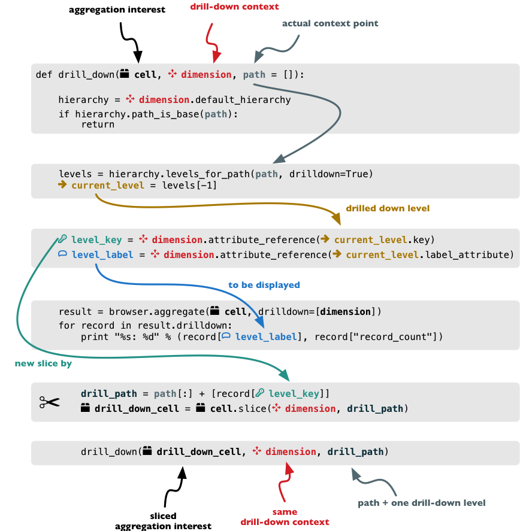

###############
Drill-down Tree
###############

Goal: Create a tree by aggregating every level of a dimension.

Level: Advanced.

Drill-down
----------

Drill-down is an action that will provide more details about data. Drilling 
down through a dimension hierarchy will expand next level of the dimension. It 
can be compared to browsing through your directory structure.

We create a function that will recursively traverse a dimension hierarchy and 
will print-out aggregations (count of records in this example) at the actual 
browsed location.

**Attributes**

* cell - cube cell to drill-down
* dimension - dimension to be traversed through all levels
* path - current path of the `dimension`

Path is list of dimension points (keys) at each level. It is like file-system 
path.

.. code-block:: python

    def drill_down(cell, dimension, path=[]):

Get dimension's default hierarchy. Cubes supports multiple hierarchies, for 
example for date you might have year-month-day or year-quarter-month-day. Most 
dimensions will have one hierarchy, thought.

.. code-block:: python

    hierarchy = dimension.hierarchy()

*Base path* is path to the most detailed element, to the leaf of a tree, to
the fact. Can we go deeper in the hierarchy?

.. code-block:: python

    if hierarchy.path_is_base(path):
        return

Get the next level in the hierarchy. `levels_for_path` returns list of levels
according to provided path. When `drilldown` is set to `True` then one more
level is returned.

.. code-block:: python

    levels = hierarchy.levels_for_path(path,drilldown=True)
    current_level = levels[-1]

We need to know name of the level key attribute which contains a path 
component. If the model does not explicitly specify key attribute for the 
level, then first attribute will be used:

.. code-block:: python

    level_key = dimension.attribute_reference(current_level.key)

For prettier display, we get name of attribute which contains label to be 
displayed for the current level. If there is no label attribute, then key 
attribute is used.

.. code-block:: python

    level_label = dimension.attribute_reference(current_level.label_attribute)

We do the aggregation of the cell... 

.. note::

    Shell analogy: Think of ``ls $CELL`` command in commandline, where 
    ``$CELL`` is a directory name. In this function we can think of ``$CELL`` 
    to be same as current working directory (``pwd``)

.. code-block:: python

    result = browser.aggregate(cell, drilldown=[dimension])

    for record in result.drilldown:
        print "%s%s: %d" % (indent, record[level_label], record["record_count"])
        ...

And now the drill-down magic. First, construct new path by key attribute value 
appended to the current path:

.. code-block:: python

        drill_path = path[:] + [record[level_key]]

Then get a new cell slice for current path:

.. code-block:: python

        drill_down_cell = cell.slice(dimension, drill_path)

And do recursive drill-down:

.. code-block:: python

        drill_down(drill_down_cell, dimension, drill_path)

The whole recursive drill down function looks like this:

    Recursive drill-down explained

Whole working example can be found in the ``tutorial`` sources.

Get the full cube (or any part of the cube you like):

.. code-block:: python

    cell = browser.full_cube()

And do the drill-down through the item dimension:

.. code-block:: python

    drill_down(cell, cube.dimension("item"))

The output should look like this::

    a: 32
        da: 8
            Borrowings: 2
            Client operations: 2
            Investments: 2
            Other: 2
        dfb: 4
            Currencies subject to restriction: 2
            Unrestricted currencies: 2
        i: 2
            Trading: 2
        lo: 2
            Net loans outstanding: 2
        nn: 2
            Nonnegotiable, nonintrest-bearing demand obligations on account of subscribed capital: 2
        oa: 6
            Assets under retirement benefit plans: 2
            Miscellaneous: 2
            Premises and equipment (net): 2

Note that because we have changed our source data, we see level codes instead 
of level names. We will fix that later. Now focus on the drill-down.

See that nice hierarchy tree?

Now if you slice the cell through year 2010 and do the exact same drill-down:

.. code-block:: python

    cell = cell.slice("year", [2010])
    drill_down(cell, cube.dimension("item"))

you will get similar tree, but only for year 2010 (obviously).

Level Labels and Details
------------------------

Codes and ids are good for machines and programmers, they are short, might
follow some scheme, easy to handle in scripts. Report users have no much use
of them, as they look cryptic and have no meaning for the first sight.

Our source data contains two columns for category and for subcategory: column
with code and column with label for user interfaces. Both columns belong to
the same dimension and to the same level. The key column is used by the
analytical system to refer to the dimension point and the label is just
decoration.

Levels can have any number of detail attributes. The detail attributes have no
analytical meaning and are just ignored during aggregations. If you want to do
analysis based on an attribute, make it a separate dimension instead.

So now we fix our model by specifying detail attributes for the levels:

.. figure:: images/cubes-tutorial03-hierarchy-detail.png
    :align: center
    :width: 400px

    Attribute details.

The model description is:

.. code-block:: javascript

    "levels": [
            {
                "name":"category",
                "label":"Category",
                "label_attribute": "category_label",
                "attributes": ["category", "category_label"]
            },
            {
                "name":"subcategory",
                "label":"Sub-category",
                "label_attribute": "subcategory_label",
                "attributes": ["subcategory", "subcategory_label"]
            },
            {
                "name":"line_item",
                "label":"Line Item",
                "attributes": ["line_item"]
            }
        ]
    }

Note the `label_attribute` keys. They specify which attribute contains label
to be displayed. Key attribute is by-default the first attribute in the list.
If one wants to use some other attribute it can be specified in
`key_attribute`.

Because we added two new attributes, we have to add mappings for them:

.. code-block:: javascript

    "mappings": { "item.line_item": "line_item",
                  "item.subcategory": "subcategory",
                  "item.subcategory_label": "subcategory_label",
                  "item.category": "category",
                  "item.category_label": "category_label" 
                 }

Now the result will be with labels instead of codes::

    Assets: 32
        Derivative Assets: 8
            Borrowings: 2
            Client operations: 2
            Investments: 2
            Other: 2
        Due from Banks: 4
            Currencies subject to restriction: 2
            Unrestricted currencies: 2
        Investments: 2
            Trading: 2
        Loans Outstanding: 2
            Net loans outstanding: 2
        Nonnegotiable: 2
            Nonnegotiable, nonintrest-bearing demand obligations on account of subscribed capital: 2
        Other Assets: 6
            Assets under retirement benefit plans: 2
            Miscellaneous: 2
            Premises and equipment (net): 2

