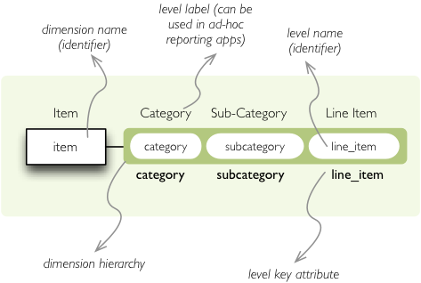

Hierarchies, levels and drilling-down
=====================================

Goals:

* how to create a hierarchical dimension
* how to do drill-down through a hierarchy
* detailed level description

Level: basic.

We are going to use very similar data as in the previous examples. Difference 
is in two added columns: category code and sub-category code. They are simple 
letter codes for the categories and subcategories. Download :download:`this 
example file <../files/IBRD_Balance_Sheet__FY2010.csv>`.

Hierarchy
---------

Some :class:`dimensions<cubes.model.Dimension>` can have multiple 
:class:`levels<cubes.model.Level>` forming a 
:class:`hierarchy<cubes.model.Hierarchy>`. For example dates have year, month, 
day; geography has country, region, city; product might have category, 
subcategory and the product.

.. note:

    Cubes supports multiple hierarchies, for example for date you might have 
    year-month-day or year-quarter-month-day. Most dimensions will have one 
    hierarchy, though.

In our example we have the `item` dimension with three levels of hierarchy: 
*category*, *subcategory* and *line item*:

    `Item` dimension hierarchy.

The levels are defined in the model:

.. code-block:: javascript

    "levels": [
        {
            "name":"category",
            "label":"Category",
            "attributes": ["category"]
        },
        {
            "name":"subcategory",
            "label":"Sub-category",
            "attributes": ["subcategory"]
        },
        {
            "name":"line_item",
            "label":"Line Item",
            "attributes": ["line_item"]
        }
    ]

.. comment:

    FIXME: the following paragraph is referencing some "previous one", that is
    something from second tutorial blog post.

You can see a slight difference between this model description and the
previous one: we didn't just specify level names and didn't let cubes to
fill-in the defaults. Here we used explicit description of each level. `name`
is level identifier, `label` is human-readable label of the level that can be
used in end-user applications and `attributes` is list of attributes that
belong to the level. The first attribute, if not specified otherwise, is the
key attribute of the level.

Other level description attributes are `key` and `label_attribute``. The `key`
specifies attribute name which contains key for the level. Key is an id
number, code or anything that uniquely identifies the dimension level.
`label_attribute` is name of an attribute that contains human-readable value
that can be displayed in user-interface elements such as tables or charts.

Preparation
-----------

.. comment:

    FIXME: include the data loading code here

Again, in short we need:

* data in a database
* logical model (see :download:`model file<../files/hierarchy_recipe_model.json>`) prepared
  with appropriate mappings
* denormalized view for aggregated browsing (optional)

Implicit hierarchy
------------------

Try to remove the last level *line_item* from the model file and see what 
happens. Code still works, but displays only two levels. What does that mean? 
If metadata - logical model - is used properly in an application, then 
application can handle most of the model changes without any application 
modifications. That is, if you add new level or remove a level, there is no 
need to change your reporting application.

Summary
-------

* hierarchies can have multiple levels
* a hierarchy level is identifier by a key attribute
* a hierarchy level can have multiple detail attributes and there is one
  special detail attribute: label attribute used for display in user
  interfaces

Multiple Hierarchies
====================

Dimension can have multiple hierarchies defined. To use specific hierarchy for
drilling down:

.. code-block:: python

    result = browser.aggregate(cell, drilldown = [("date", "dmy", None)])

The `drilldown` argument takes list of three element tuples in form:
(`dimension`, `hierarchy`, `level`). The `hierarchy` and `level` are optional.
If `level` is ``None``, as in our example, then next level is used. If
`hierarchy` is ``None`` then default hierarchy is used.

To sepcify hierarchy in cell cuts just pass `hierarchy` argument during cut
construction. For example to specify cut through week 15 in year 2010:

.. code-block:: python

    cut = cubes.PointCut("date", [2010, 15], hierarchy="ywd")

.. note::

    If drilling down a hierarchy and asking cubes for next implicit level the
    cuts should be using same hierarchy as drilldown. Otherwise exception is
    raised. For example: if cutting through year-month-day and asking for next
    level after year in year-week-day hierarchy, exception is raised.

