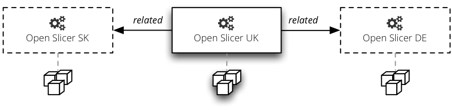

###############################
Publishing Open Data with Cubes
###############################

Cubes and Slicer were built with Open Data or rather Open Analytical Data in
mind.

Read more about Open Data:

* `Open Data <http://en.wikipedia.org/wiki/Open_data>`_ (Wikipedia)
* `Defining Open Data <http://blog.okfn.org/2013/10/03/defining-open-data/>`_
  (OKFN)
* `What is Open Data <http://opendatahandbook.org/en/what-is-open-data/>`_
  (Open Data Handbook)

With Cubes you can have a server that provides raw detailed data (denormalized
facts) and grouped and aggregated data (aggregates). It is possible to serve
multiple datasets which might share properties (dimensions).

Serving Open Data
=================

Just create a public :doc:`Slicer server<../server>`. To provide more metadata
add a ``info.json`` file with the following contents:

* ``label`` – server's name or label
* ``description`` – description of the served data
* ``copyright`` – copyright of the data, if any
* ``license`` – data license, such as `Creative
  Commons <http://creativecommons.org>`_, Public Domain or
  `other <http://opendatacommons.org/licenses/>`_
* ``maintainer`` – name of the data maintainer, might be in format ``Name
  Surname <namesurname@domain.org>``
* ``contributors`` - list of contributors (if any)
* ``keywords`` – list of keywords that describe the data
* ``related`` – list of related or "friendly" Slicer servers with other open
  data
* ``visualizations`` – list of links to prepared visualisations of the
  server's data

Create a ``info.json`` file:

.. code-block:: json

    {
        "description": "Some Open Data",
        "license": "Public Domain",
        "keywords": ["budget", "financial"],
    }

Include `info` option in the slicer configuration::

    [workspace]
    info: info.json

Related Servers
---------------

For better open data discoverability you might add links to other servers:

    Related slicers.

.. code-block:: json

    {
        "related": [
            {
                "label": "Slicer – Germany",
                "url": "http://slicer.somewhere.de",
            },
            {
                "label": "Slicer – Slovakia",
                "url": "http://slicer.somewhere.sk",
            }
        ]
    }

