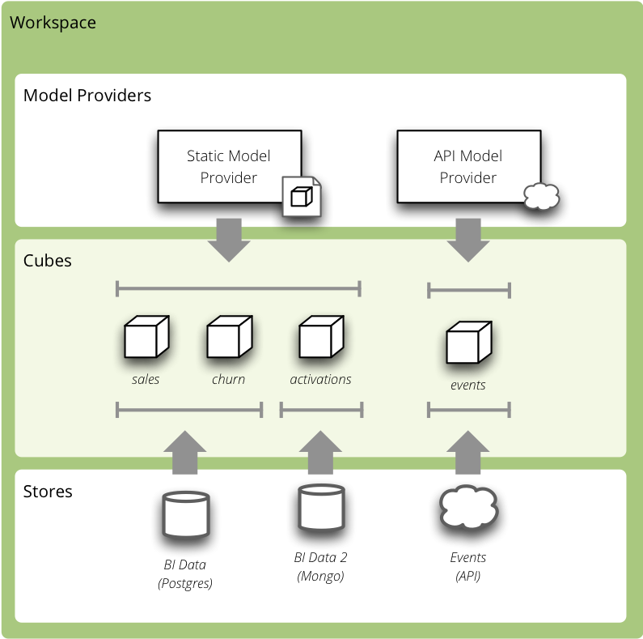

***********************
Cubes 1.0 release notes
***********************

These release notes cover the new features and changes (some of them backward
incompatible).

Overview
========

The biggest new feature in cubes is the "pluggable" model. You are no longer
limited to one one model, one type of data store (database) and one set of
cubes. The new `Workspace` is now framework-level controller object that
manages models (model sources), cubes and datastores. To the future more
features will be added to the workspace.

    Analytical Workspace Overview

New Workspace related objects:

* model provider – creates model objects from a model source (might be a
  foreign API/service or custom database)
* store – provides access and connection to cube's data

For more information see the :doc:`Workspace <../workspace>` documentation.

Other notable new features in Cubes 1.0 are:

* Rewritten Slicer server in `Flask <http://flask.pocoo.org>`_ as a reusable
  `Blueprint <http://flask.pocoo.org/docs/blueprints/>`_.
* New :doc:`server API <../server>`.
* support for :ref:`outer joins <sql-outer-joins>` in the :doc:`SQL backend
  <../backends/sql>`.
* Distinction between :ref:`measures and aggregates <measures-and-aggregates>`
* Extensible :doc:`authorization and authentication <../auth>`
* Visualizer

Python Versions
---------------

Cubes 1.0 supports Python >= 2.7 for Python 2 series and Python >= 3.4.1 for
Python 3 series.

Analytical Workspace
--------------------

The old backend architecture was limiting. It allowed only one store to be
used, the model had to be known before the server started, it was not possible
to get the model from a remote source.

For more details about the new workspace see the :doc:`../workspace`
documentation.

.. _configuration_1_0:

Configuration
-------------

The `slicer.ini` configuration has changed to reflect new features.

The section ``[workspace]`` now contains global configuration of a cubes
workspace session. The database connection has moved into ``[store]`` (or
similar, if there are more).

The database connection is specified either in the ``[store]`` section or in a
separate ``stores.ini`` file where one section is one store, section name is
store name (as referenced from cube models).

If there is only one model, it can be specified either in the ``[workspace]``
section as ``model``. Multiple models are specified in the ``[models]``
section.

To sum it up:

* ``[server] backend`` is now ``[store] type`` for every store
* ``[server] log`` and ``log_level`` has moved to ``[workspace]``
* ``[model]`` is now either ``model`` option of ``[workspace]`` or list of
  multiple models in the ``[models]`` section

The old configuration:

.. code-block:: ini

    [server]
    host: localhost
    port: 5000
    reload: yes
    log_level: info

    [workspace]
    url: postgres://localhost/mydata"

    [model]
    path: grants_model.json
    

Is now:

.. code-block:: ini

    [workspace]
    log_level: info
    model: grants_model.json

    [server]
    host: localhost
    port: 5000
    reload: yes

    [store]
    type: sql
    url: postgres://localhost/mydata

Check your configuration files.

.. seealso::

    :doc:`../configuration`

Server
------

Slicer server is now a `Flask <http://flask.pocoo.org>`_ application and a
reusable `Blueprint <http://flask.pocoo.org/docs/blueprints/>`_. It is
possible to include the Slicer in your application at an end-point of your
choice. 

For more information, see the :doc:`recipe <../recipes/flask_integration>`.

Other server changes:

* do not expose internal exceptions, only user exceptions
* added simple authentication methods: HTTP Basic (behind a proxy) and
  parameter-based identity. Both are permissive and serve just for passing an
  identity to the authorizer.

HTTP Server API
---------------

Server end-points have changed.

New end-points:

* ``/version``
* ``/info``
* ``/cubes``
* ``/cube/<cube>/model``
* ``/cube/<cube>/aggregate``
* ``/cube/<cube>/facts``
* ``/cube/<cube>/fact``
* ``/cube/<cube>/members/<dimension>``
* ``/cube/<cube>/cell``
* ``/cube/<cube>/report``

Removed end-points:

* ``/model`` – without replacement doe to the new concepts of workspace.
  Alternative is to get list of basic cube info using ``/cubes``.
* ``/model/cubes`` – without replacement, use ``/cubes``
* ``/model/cube/<cube>`` – use ``/cube/<cube>/model`` instead
* ``/model/dimension/*`` – without replacement due to the new concepts of
  workspace
* all top-level browser actions such as ``/aggregate`` – now the cube name has
  to be explicit

Parameter changes:

* ``/aggregate`` uses ``aggregates=``, does not accept ``measure=`` any more
* ``/aggregate`` now accepts ``format=`` to generate CSV output
* new parameter ``headers=`` for CSV output: with headers as attribute names,
  headers as attribute labels (human readable) or no headers at all
* it is now possible to specify multiple drilldowns, separated by ``|`` in one
  ``drilldown=`` parameter
* cuts for date dimension accepts named relative time references such as
  ``cut=date:90daysago-today``. See the :ref:`server documentation
  <named_relative_time>` for more information.
* dimension path elements can contain special characters if they are escaped
  by a backslash ``\`` such as ``cut=city:Nové\ Mesto``

Many actions now accept ``format=`` parameter, which can be ``json``, ``csv``
or ``json_lines`` (new-line separated JSON).

Response changes:

* ``/cubes`` (replacement for ``/model``) returns a list of basic cubes info:
  `name`, `label`, `description` and `category`. It does not return full cube
  description with dimensions.
* ``/cube/<cube>/model`` has new keys: ``aggregates`` and ``features``

.. seealso::

    :doc:`../server`

Outer Joins
-----------

Support for thee types of joins was added to the SQL backend: `match` (inner),
`master` (left outer) and `detail` (right outer).

The *outer joins* allows for example to use whole ``date`` dimension table and
have "empty cells" for dates where there are no facts.

When an right outer join (``detail`` method) is present, then aggregate values
are coalesced to zero (based on the function either the values or the result
is coalesced). For example: AVG coalesces values: ``AVG(COALESCE(c, 0))``, SUM
coalesces result: ``COALESCE(SUM(c), 0)``. 

.. seealso::

    :ref:`SQL Backend – Outer Joins Documentation<sql-outer-joins>`

Statutils
---------

Module with statistical aggregate functions such as simple moving average or
weighted moving average.

Provided functions:

* ``wma`` – weighted moving average
* ``sma`` – simple moving average
* ``sms`` – simple moving sum
* ``smstd`` – simple moving st. deviation
* ``smrsd`` – simple moving relative st. deviation
* ``smvar`` – simple moving variance

The function are applied on the already computed aggregation results. Backends
migh handle the function internally if they can.

Window functions respect `window_size` property of aggregates.

Browser
-------

* cuts now have an `invert` flag (might not be supported by all backends)
* `aggregate()` has new argument `split` which is a cell that defines
  artificial flag-like dimension with two values: `0` – aggergated cell is
  outside of the split cell, `1` – aggregated cell is within the split cell

Both `invert` and `split` features are still provisional, their interface
might change.

Slicer
------

* added ``slicer model convert`` to convert between json and directory bundle

Model
=====

Model and modeling related changes are:

* new concept of model providers (see :ref:`details below <model_providers_1_0>`)
* measure aggregates (see :ref:`details below <measure_aggregates_1_0>`)
* cardinality of dimensions and dimension levels
* dimension and level roles
* attribute missing values
* `format` property of a measure and aggregate
* namespaces

.. note::

    ``cubes``, ``dimensions``, ``levels`` and ``hierarchies`` can no longer be
    dictionaries, they should be lists of dictionaries and the dictionaries
    should have a ``name`` property set. This was depreciated long ago.

.. _model_providers_1_0:

Model Providers
---------------

The models of cubes are now being created by the *model providers*. Model
provider is an object that creates `Cubes` and `Dimension` instances from it's
source. Built-in model provider is :class:`cubes.StaticModelProvider` which
creates cubes objects from JSON files and dictionaries.

.. seealso::

    :doc:`../extensions/providers`, :doc:`../reference/providers`

.. _measure_aggregates_1_0:

Namespaces
----------

Cubes from stores can be wrapped in a model namespace. By-default, the
namespace is the same as the name of the store. The cubes are referenced as
`NAMESPACE.CUBE` such as `foreign.sales`. For backward compatibility reasons
and for simplicity there are two cube lookup methods: `recursive` and
`global`.

Measures and Aggregates
-----------------------

Cubes now distinguishes between *measures* and *aggregates*.  *measure*
represents a numerical fact property, *aggregate* represents aggregated value
(applied aggregate function on a property, or provided natively by the
backend).

This new approach of *aggregates* makes development of backends and clients
much easier. There is no need to construct and guess aggregate measures or
splitting the names from the functions. Backends receive concrete objects with
sufficient information to perform the aggregation (either by a function or
fetch already computed value).

Functionality additions and changes:

* New model objects: :class:`cubes.Attribute` (for dimension or detail),
  :class:`cubes.Measure` and :class:`cubes.MeasureAggregate`.
* New model creation/helper functions: :func:`cubes.create_measure_aggregate`,
  :func:`cubes.create_measure`

* :func:`cubes.create_cube` is back

* :meth:`cubes.Cube.aggregates_for_measure` – return all aggregates referring the
  measure
* :meth:`cubes.Cube.get_aggregates` – get a list of aggregates according to names
* :meth:`cubes.Measure.default_aggregates` – create a list of default
  aggregates for the measure
* :func:`calculators_for_aggregates` in statutils – returns post-aggregation
  calculators
* Added a cube metadata flag to control creation of default aggregates:
  `implicit_aggregates`. Default is ``True``
* Cube initialization has no creation of defaults – it should belong to the
  model provider or :func:`create_cube` function

* If there is no function specified, we consider the aggregate to be specified
  in the mappings

.. _record_count_1_0:

record_count
------------

Implicit aggregate `record_count` is no longer provided for every cube. It
has to be explicitly defined as an aggregate: 

.. code-block:: javascript

    "aggregates": [
        {
            "name": "item_count",
            "label": "Total Items",
            "function": "count"
        }
    ]

It can be named and labelled in any way.

If cube has no aggregates, then new default aggregate named `fact_count` is
created.

.. seealso::

    :ref:`Measures and Aggregates Documentation <measures-and-aggregates>`,
    :doc:`../model`

Dimension Links
---------------

Linking of dimensions to cubes can be fine-tuned by specifying multiple
properties of the dimension in the cube's context:

* `hierarchies` – cube's dimension can have only certain hierarchies from the
  original dimension
* `detault_hierarchy_name` – it is possible to specify different default
  hierarchy
* `nonadditive` – override the dimensions' non-additive property
* `cardinality` – use if dimension might have different cardinality in the new
  context
* `alias` – reuse dimensions in a cube but give them different names

Backends
========

* Backends should now implement `provide_aggregate()` method instead of
  `aggregate()` – the later takes care of argument conversion and preparation.
  See :doc:`../extensions/backends` for more information.

SQL Backend
-----------

* New module ``functions`` with new AggregationFunction objects
* Added get_aggregate_function() and available_aggregate_functions()
* Renamed ``star`` module to ``browser``
* Updated the code to use the new aggregates instead of old measures. Affected
  parts of the code are now cleaner and more understandable
* Moved calculated_aggregations_for_measure to library-level statutils module
  as calculators_for_aggregates 
* function dictionary is no longer used

New Backends
------------

* `Mixpanel`: :doc:`../backends/mixpanel`
* `Slicer`: :doc:`../backends/slicer`
* `Mongo`: :doc:`../backends/mongo`
* `Google Analytics`: :doc:`../backends/google_analytics`

.. seealso::

    :doc:`How to Write a Backend Extension <../extensions/backends>`

Visualizer
==========

There is a cubes visualizer included in the Cubes that can connect to any
cubes slicer server over HTTP. It is purely HTML/JavaScript application.

Other Minor Changes
===================

* Cell.contains_level(dim, level, hierarhy) – returns ``True`` when the cell
  contains level ``level`` of dimension ``dim``
* renamed `AggregationBrowser.values()` to
  :meth:`cubes.AggregationBrowser.members`
* `AggregationResult.measures` changed to `AggregationResult.aggregates` (see
  :class:`AggregationResult`)
* browser's `__init__` signature has changed to include the store
* changed the exception hierarchy. Now has two branches: ``UserError`` and
  ``InternalError`` – the ``UserError`` can be returned to the client, the
  ``InternalError`` should remain privade on the server side.
* ``to_dict()`` of model objects returns an ordered dictionary for nicer JSON
  output
* New class :class:`cubes.Facts` that should be returned by
  :meth:`cubes.AggregationBrowser.facts`
* :func:`cubes.cuts_from_string` has two new arguments `member_converters` and
  `role_member_converters`
* New class :class:`cubes.Drilldown` to get more information about the
  drilldown

Migration to 1.0
================

Checklists for migrating a Cubes project from pre-1.0 to 1.0:

The ``slicer.ini``
------------------

1. Rename ``[workspace]`` to ``[store]``
2. Create new empty ``[workspace]``
3. Move ``[server] backend`` to ``[store] type``
4. Move ``[server] log``, ``log_level`` to the new ``[workspace]``
5. Rename ``[model] path`` to ``[models] main`` and remove all non-model references
   (such as ``locales``).

The minimal configuration looks like:

.. code-block:: ini

    [store]
    type: sql
    url: sqlite:///data.sqlite

    [models]
    main: model.json

See :ref:`configuration changes <configuration_1_0>` for an example and
:doc:`configuration documentation <../configuration>` for more information.

The Model
---------

There are not many model changes, mostly measures and aggregates related.

1. Make sure that ``dimensions``, ``cubes``, ``levels`` and ``hierarchies``
   are not dictionaries but lists of dictionaries with ``name`` property.
2. Create the explicit ``record_count`` aggregate, if you are using it. Note
   that you can name and label the aggregate as you like.

  .. code-block:: javascript

      "aggregates": [
          {
              "name": "record_count",
              "label": "Total Items",
              "function": "count"
          }
      ]

3. In ``measures`` rename ``aggregations`` to ``aggregates`` or even better:
   create explicit, full aggregate definitions.

See :ref:`Aggregates <measures-and-aggregates>` for more information.

Slicer Front-end
----------------

The biggest change in the front-ends is the removal of the ``/model``
end-point without equivalend replacement. Use ``/cubes`` to get list of
provided cubes. The cube definition contains whole dimension descriptions.

1. Change from ``/model`` to ``/cubes``
2. Change from ``/model/cube/<name>`` to ``/cube/<name>/model``
3. Cube has to be explicit in every request, therefore ``/aggregate`` does not
   work any more, use ``/cube/<name>/aggregate``
4. Change ``aggregate`` parameter ``measure`` to ``aggregates``

Refer to the :doc:`../server` documentation for the new response structures.
There were minor changes, mostly additions.

Additional and Optional Considerations for Migration
----------------------------------------------------

* if your model is too big, split it into multiple models and add them to the
  ``[models]`` section. Note that the dimensions can be shared between models.
* put all your models into a separate directory and use the ``[workspace]
  models_path`` property. The paths in ``[models]`` are relative to the
  ``models_path``
* if you have muliple stores, create a separate ``stores.ini`` file where the
  section names are store names. Set the ``[workspace] stores`` to the
  ``stores.ini`` path if it is different than default.

* Add ``"role"="time"`` to a `date` dimension – you might benefit
  from new date-related additions and special dimension handling in the
  available front-ends
* Review ``joins`` and set appropriate join method if desired, for example
  ``detail`` for a date dimension.
* Add ``cardinality`` metadata to dimension levels if appropriate.

* Look at the cube's model ``features`` property to learn what the front-end
  can expect from the backend for that cube
* Look at the ``/info`` response

v1.0.1 Changes
==============

* [feature] Added SimpleAuthorizer.expand_roles
* [feature] create indexes for aggregated table
* [change] make workspace optional
* [change] Allow user to supply an external workspace to the slicer
* [change] modified create_cube_aggregate
* [fix] correct physical attribute schema handling in SQL backend - fact
  details were getting dimension schema
* [fix] increase debug level in hello_world example
* [fix] more descriptive error messages in browser/backend
* [fix] Use store instead of datastore (remaining places)

* various documentation fixes
* various example fixes

Contributors:

* Dmitriy Trochshenko
* Friedrich Lindenberg
* Lucas Taylor
* Michal Skop
* Gasper Zejn
* jerry dumblauskas
