******************
Schemas and Models
******************

This section contains example database schemas and their respective models
with description. The examples are for the SQL backend. Please refer to the
backend documentation of your choice for more information about non-SQL
setups.

.. seealso::

    :doc:`model`
        Logical model description.

    :doc:`backends/index`
        Backend references.

    :doc:`reference/model`
        Developer's reference of model classes and functions.

Basic Schemas
=============

Simple Star Schema
------------------

*Synopsis: Fact table has the same name as the cube, dimension tables have
same names as dimensions.*

Fact table is called `sales`, has one measure `amount` and two dimensions:
`store` and `product`. Each dimension has two attributes.

.. image:: images/schemas/schema-default.png
    :align: center

.. code-block:: javascript

   "cubes": [
       {
           "name": "sales",
           "dimensions": ["product", "store"],
           "joins": [
               {"master":"product_id", "detail":"product.id"},
               {"master":"store_id", "detail":"store.id"}
           ]
       }
   ],
   "dimensions": [
       { "name": "product", "attributes": ["code", "name"] },
       { "name": "store", "attributes": ["code", "address"] }
   ]
    

Simple Dimension
----------------

*Synopsis: Dimension is represented only by one attribute, has no details,
neither hierarchy.*

Similar schema as `Simple Star Schema`_ Note the dimension `year` which is
represented just by one numeric attribute.

It is important that no attributes are specified for the dimension. There
dimension will be referenced just by its name and dimension label is going to
be used as attribute label as well.

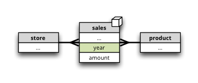

.. code-block:: javascript

   "cubes": [
       {
           "name": "sales",
           "dimensions": ["product", "store", "year"],
           "joins": [
               {"master":"product_id", "detail":"product.id"},
               {"master":"store_id", "detail":"store.id"}
           ]
       }
   ],
   "dimensions": [
       { "name": "product", "attributes": ["code", "name"] },
       { "name": "store", "attributes": ["code", "address"] }
       { "name": "year" }
   ]

Table Prefix
------------

*Synopsis: dimension tables share a common prefix, fact tables share common
prefix.*

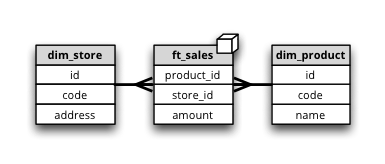

In our example the dimension tables have prefix ``dim_`` as in ``dim_product``
or ``dim_store`` and facts have prefix ``fact_`` as in ``fact_sales``.

There is no need to change the model, only the data store configuration. In
Python code we specify the prefix during the data store registration in
:meth:`cubes.Workspace.register_store`:

.. code-block:: python

    workspace = Workspace()
    workspace.register_store("default", "sql",
                             url=DATABASE_URL,
                             dimension_prefix="dim_",
                             dimension_suffix="_dim",
                             fact_suffix="_fact",
                             fact_prefix="fact_")

When using the :doc:`server` we specify the prefixes in the ``[store]``
section of the `slicer.ini` configuration file:

.. code-block:: ini

    [store]
    ...
    dimension_prefix="dim_"
    fact_prefix="fact_"

Not Default Database Schema
---------------------------

*Synopsis: all tables are stored in one common schema that is other than
default database schema.*

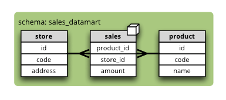

To specify database schema (in our example ``sales_datamart``) in Python pass
it in the `schema` argument of :meth:`cubes.Workspace.register_store`:

.. code-block:: python

    workspace = Workspace()
    workspace.register_store("default", "sql",
                             url=DATABASE_URL,
                             schema="sales_datamart")

For the :doc:`server` the schema is specified in in the ``[store]`` section
of the `slicer.ini` configuration file:

.. code-block:: ini

    [store]
    ...
    schema="sales_datamart"

Separate Dimension Schema
-------------------------

*Synopsis: dimension tables share one database schema and fact tables share
another database schema*

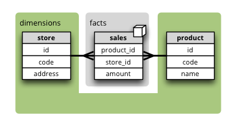

Dimensions can be stored in a different database schema than the fact table
schema.

To specify database schema of dimensions (in our example ``dimensions``) in
Python pass it in the `dimension_schema` argument of
:meth:`cubes.Workspace.register_store`:

.. code-block:: python

    workspace = Workspace()
    workspace.register_store("default", "sql",
                                       url=DATABASE_URL,
                                       schema="facts",
                                       dimension_schema="dimensions")

For the :doc:`server` the dimension schema is specified in the
``[store]`` section of the `slicer.ini` configuration file:

.. code-block:: ini

    [store]
    ...
    schema="facts"
    dimension_schema="dimensions"

Many-to-Many Relationship
-------------------------

*Synopsis: One fact might have multiple dimension members assigned*

There are several options how the case of multiple dimension members per fact
can be solved. Each has it advantages and disadvantages. Here is one of them:
using a bridge table.

This is our logical intention: there might be multiple representatives
involved in an interaction cases:

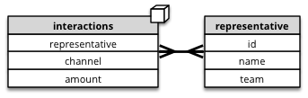

We can solve the problem with adding a bridge table and by creating artificial
level `representative_group`. This group is unique combination of
representatives that were involved in an interaction.

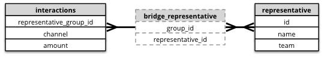

The model looks like:

.. code-block:: javascript

    "cubes": [
        {
            "dimensions": ["representative", ...],
            "joins": [
                {
                    "master":"representative_group_id",
                    "detail":"bridge_representative.group_id"
                },
                {
                    "master":"bridge_representative.representative_id",
                    "detail":"representative.id"
                }
            ]
        }
    ],
    "dimensions": [
        {
            "name": "representative",
            "levels": [
                { "name":"team" },
                { "name":"name", "nonadditive": "any"}
            ]
        }
    ]

You might have noticed that the bridge table is hidden – you can't see it's
contents anywhere in the cube.

There is one problem with aggregations when such dimension is involved: by
aggregating over any level that is not the most detailed (deepest) we might
get double (multiple) counting of the dimension members. For this reason it is
important to specify all higher levels as `nonadditive` for ``any`` other
dimension. It his case, backends that are aware of the issue, might handle it
appropriately.

Some front-ends might not even allow to aggregate by levels that are marked as
`nonadditivy`.

Mappings
========

Following patterns use the :ref:`explicit_mapping`. 

Basic Attribute Mapping
-----------------------

*Synopsis: table column has different name than a dimension attribute or a
measure.*

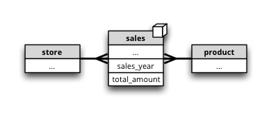

In our example we have a flat dimension called `year`, but the physical table
column is “sales_year”. In addition we have a measure `amount` however
respective physical column is named `total_amount`.

We define the `mappings` within a cube:

.. code-block:: javascript

   "cubes": [
       {
           "dimensions": [..., "year"],
           "measures": ["amount"],
           "mappings": {
               "year":"sales_year",
               "amount":"total_amount"]
           }
       }
   ],
   "dimensions": [
       ...
       { "name": "year" }
   ]

Shared Dimension Table
----------------------

*Synopsis: multiple dimensions share the same dimension table*

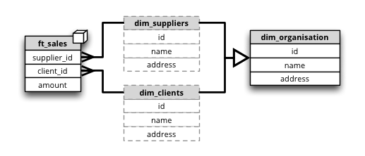

Clients and suppliers might share one table with all organisations and
companies. We have to specify a table alias in the `joins` part of the cube
definition. The table aliases should follow the same naming pattern as the
other tables – that is, if we are using dimension prefix, then the alias
should include the prefix as well:

If the alias follows dimension naming convention, as in the example, then no
mapping is required.

.. code-block:: javascript

    "cubes": [
        {
            "name": "sales"
            "dimensions": ["supplier", "client"],
            "measures": ["amount"],
            "joins": [
                {
                    "master":"supplier_id",
                    "detail":"dim_organisation.id",
                    "alias":"dim_supplier" 
                },
                {
                    "master":"client_id",
                    "detail":"dim_organisation.id",
                    "alias":"dim_client" 
                }
            ]
        }
    ],
    "dimensions": [
        { 
          "name": "supplier",
          "attributes": ["id", "name", "address"]
        },
        { 
          "name": "client",
          "attributes": ["id", "name", "address"
        }
    ]

Hierarchies
===========

Following patterns show how to specify one or multiple dimension hierarchies.

Simple Hierarchy
----------------

*Synopsis: Dimension has more than one level.*

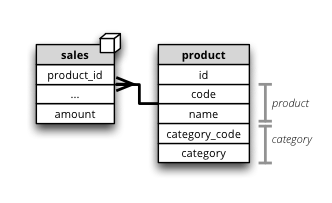

`Product` dimension has two levels: `product category` and `product`. The
`product category` level is represented by two attributes ``category_code``
(as key) and ``category``. The `product` has also two attributes:
``product_code`` and ``name``.

.. code-block:: javascript

    "cubes": [
        {
            "dimensions": ["product", ...],
            "measures": ["amount"],
            "joins": [
                {"master":"product_id", "detail":"product.id"}
            ]
        }
    ],
    "dimensions": [
        {
            "name": "product",
            "levels": [
                {
                    "name":"category",
                    "attributes": ["category_code", "category"]
                },
                {
                    "name":"product",
                    "attributes": ["code", "name"]
                }
            ]
        }
    ]
 
  
Multiple Hierarchies
--------------------

*Synopsis: Dimension has multiple ways how to organise levels into hierarchies.*

.. image:: images/schemas/schema-hierarchy2.png
    :align: center

Dimensions such as `date` (depicted below) or `geography` might have multiple
ways of organizing their attributes into a hierarchy. The date can be composed
of `year-month-day` or `year-quarter-month-day`.

To define multiple hierarchies, first define all possible levels. Then create
list of hierarchies where you specify order of levels for that particular
hierarchy.

The code example below is in the “dimensions” section of the model:

.. code-block:: javascript

    {
        "name":"date",
        "levels": [
            { "name": "year", "attributes": ["year"] },
            { "name": "quarter", "attributes": ["quarter"] },
            { "name": "month", "attributes": ["month", "month_name"] },
            { "name": "week", "attributes": ["week"] },
            { "name": "weekday", "attributes": ["weekday"] },
            { "name": "day", "attributes": ["day"] }
        ],
        "hierarchies": [
            {"name": "ymd", "levels":["year", "month", "day"]},
            {"name": "ym", "levels":["year", "month"]},
            {"name": "yqmd", "levels":["year", "quarter", "month", "day"]},
            {"name": "ywd", "levels":["year", "week", "weekday"]}
        ],
        "default_hierarchy_name": "ymd"
    }

The ``default_hierarchy_name`` specifies which hierarchy will be used if not
mentioned explicitly.

Multiple Tables for Dimension Levels
------------------------------------

*Synopsis: Each dimension level has a separate table*

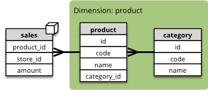

We have to join additional tables and map the attributes that are not in the
"main" dimension table (table with the same name as the dimension):

.. code-block:: javascript

    "cubes": [
        {
            "dimensions": ["product", ...],
            "measures": ["amount"],
            "joins": [
                {"master":"product_id", "detail":"product.id"},
                {"master":"product.category_id", "detail":"category.id"}
            ],
            "mappings": {
                "product.category_code": "category.code",
                "product.category": "category.name"
            }
        }
    ],
    "dimensions": [
        {
            "name": "product",
            "levels": [
                {
                    "name":"category",
                    "attributes": ["category_code", "category"]
                },
                {
                    "name":"product",
                    "attributes": ["code", "name"]
                }
            ]
        }
    ]

.. note::

    Joins should be ordered "from the master towards the details". That means
    that always join tables closer to the fact table before the other tables.

User-oriented Metadata
======================

Model Labels
------------

*Synopsis: Labels for parts of model that are to be displayed to the user*

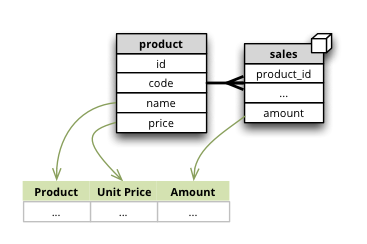

Labels are used in report tables as column headings or as filter descriptions. 
Attribute (and column) names should be used only for report creation and
despite being readable and understandable, they should not be presented to the
user in the raw form.

Labels can be specified for any model object (cube, dimension, level,
attribute) with the `label` attribute:

.. code-block:: javascript
    
    "cubes": [
        {
            "name": "sales",
            "label": "Product Sales",
            "dimensions": ["product", ...]
        }
    ],
    "dimensions": [
        {
            "name": "product",
            "label": "Product",
            "attributes": [
                {"name": "code", "label": "Code"},
                {"name": "name", "label": "Product"},
                {"name": "price", "label": "Unit Price"},
            ]
        }
    ]

Key and Label Attribute
-----------------------

*Synopsis: specify which attributes are going to be used for flitering (keys)
and which are going to be displayed in the user interface (labels)*

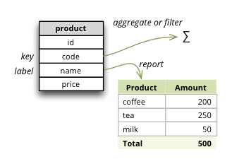

.. code-block:: javascript

    "dimensions": [
        {
            "name": "product",
            "levels": [
                {
                    "name": "product",
                    "attributes": ["code", "name", "price"]
                    "key": "code",
                    "label_attribute": "name"
                }
            ]
        }
    ]

Example use:

.. code-block:: python

    result = browser.aggregate(drilldown=["product"])

    for row in result.table_rows("product"):
       print "%s: %s" % (row.label, row.record["amount_sum"])

Localization
============

Localized Data
--------------

*Synopsis: attributes might have values in multiple languages*

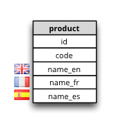

Dimension attributes might have language-specific content. In cubes it can be
achieved by providing one column per language (denormalized localization). The
default column name should be the same as the localized attribute name with
locale suffix, for example if the reported attribute is called `name` then the
columns should be `name_en` for English localization and `name_hu` for
Hungarian localization. 

.. code-block:: javascript

   "dimensions": [
        {
            "name": "product",
            "label": "Product",
            "attributes": [
                {"name": "code", "label": "Code"},
                {
                    "name": "name",
                    "label": "Product",
                    "locales": ["en", "fr", "es"]
                }
            ]
        }
    ]

Use in Python:

.. code-block:: python

	browser = workspace.browser(cube, locale="fr")

The `browser` instance will now use only the French localization of attributes
if available.

In slicer server requests language can be specified by the ``lang=`` parameter
in the URL.

The dimension attributes are referred in the same way, regardless of
localization. No change to reports is necessary when a new language is added.

Notes:

* only one locale per browser instance – either switch the locale or create
  another browser
* when non-existing locale is requested, then the default (first in the list
  of the localized attribute) locale is used

Localized Model Labels
----------------------

*Synopsis: Labels of model objects, such as dimensions, levels or attributes
are localized.*

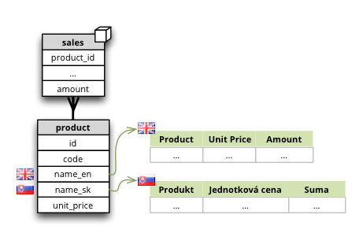

.. note::

   Way how model is localized is not yet decided, the current implementation
   might be changed.
   
We have a reporting site that uses two languages: English and Slovak. We want
all labels to be available in both of the languages. Also we have a product
name that has to be localized.

First we define the model and specify that the default locale of the model is
English (for this case). Note the `locale` property of the model, the `label`
attributes and the locales of `product.name` attribute: 

.. code-block:: javascript

    {
        "locale": "en",
        "cubes": [
            {
                "name": "sales",
                "label": "Product Sales",
                "dimensions": ["product"],
                "measures": [
                    {"name": "amount", "label": "Amount"}
                ]
            }
        ],
        "dimensions": [
            {
                "name": "product",
                "label": "Product",
                "attributes": [
                    {
                      "name": "code",
                      "label": "Code"
                    },
                    {
                      "name": "name",
                      "label": "Product",
                      "locales": ["en", "sk"]
                    },
                    {
                      "name": "price",
                      "label": "Unit Price"
                    }
                ]
            }
        ]
    }
   

Next we create a separate translation dictionary for the other locale, in our
case it is Slovak or ``sk``. If we are translating only labels, no
descriptions or any other information, we can use the simplified form:

.. code-block:: javascript

    {
       "locale": "sk",
       "dimensions":
       {
          "product”:
          {
               "levels":
               {
                  "product" : "Produkt" 
               },
               "attributes" :
               {
                   "code": "Kód produktu",
                   "name": "Produkt",
                   "price": "Jednotková cena"
               }
            }
        },
        "cubes":
        {
            "sales":
            {
                "measures":
                {
                    "amount": "Suma"
                }
            }
        }
    }

Full localization with detailed dictionaries looks like this:

.. code-block:: javascript

    {
       "locale": "sk",
       "dimensions":
       {
          "product”:
          {
               "levels":
               {
                  "product" : { "label" : "Produkt"}
               },
               "attributes" :
               {
                   "code": {"label": "Kód produktu"},
                   "name": {"label": "Produkt"},
                   "price": {"label": "Jednotková cena"}
               }
            }
        },
        "cubes":
        {
            "sales":
            {
                "measures":
                {
                    "amount": {"label": "Suma"}
                }
            }
        }
    }

..

    To create a model with translations:

    .. code-block:: python

        translations = {"sk": "model-sk.json"}
        model = create_model("model.json", translations)

    The model created this way will be in the default locale. To get localized
    version of the master model:

    .. code-block:: python

        localized_model = model.localize("sk")

    .. note::

        The :meth:`cubes.Workspace.browser` method creates a browser with
        appropriate model localization, no explicit request for localization is
        needed.

