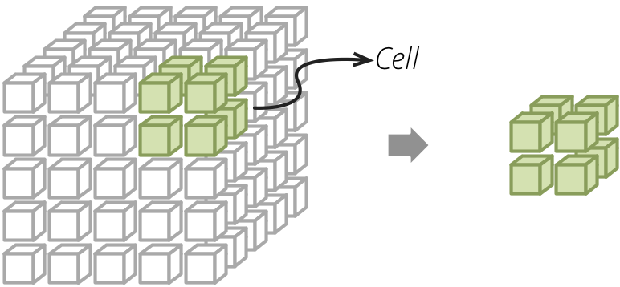
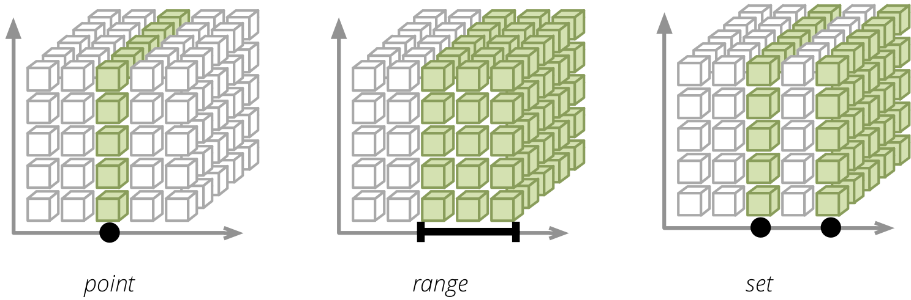

##################
Slicing and Dicing
##################

.. note::

    Examples are in Python and in Slicer HTTP requests.

Browser
=======

The aggregation, slicing, dicing, browsing of the multi-dimensional data is
being done by an AggregationBrowser. 

.. code-block:: python

    from cubes import Workspace

    workspace = Workspace("slicer.ini")
    browser = workspace.browser()

Cell and Cuts
=============

Cell defines a point of interest – portion of the cube to be aggregated or
browsed.

There are three types of cells: `point` – defines a single point in a dimension
at a particular level; `range` – defines all points of an ordered dimension
(such as date) within the range and `set` – collection of points:

Points are defined as dimension `paths` – list of dimension level keys. For
example a date path for 24th of December 2010 would be: ``[2010, 12, 24]``.
For December 2010, regardless of day: ``[2010, 12]`` and for the whole year:
it would be a single item list ``[2010]``. Similar for other dimensions:
``["sk", "Bratislava"]`` for city `Bratislava` in `Slovakia` (code ``sk``).

In Python the cuts for "sales in Slovakia between June 2010 and June 2012" are
defined as:

.. code-block:: python

    cuts = [
        PointCut("geography", ["sk"]),
        PointCut("date", [2010, 6], [2012, 6])
    ]

Same cuts for Slicer: ``cut=geography:sk|date:2010,6-2012,6``.

If a different hierarchy than default is desired – "from the second quartal of
2010 to the second quartal of 2012":

.. code-block:: python

    cuts = [
        PointCut("date", [2010, 2], [2012, 2], hierarchy="yqmd")
    ]

Slicer: ``cut=date@yqmd:2010,2-2012,2``.

Ranges and sets might have unequal depths: from ``[2010]`` to ``[2012,12,24]``
means "from the beginning of the year 2010 to December 24th 2012".

.. code-block:: python

    cuts = [
        PointCut("date", [2010], [2012, 12, 24])
    ]

Slicer: ``cut=date:2010-2012,12,24``.

Ranges might be open, such as "everything until Dec 24 2012":

.. code-block:: python

    cuts = [
        PointCut("date", None, [2012, 12, 24])
    ]

Slicer: ``cut=date:-2012,12,24``.

Aggregate
=========

.. code-block:: python

    browser = workspace.browser("sales")
    result = browser.aggregate()

    print result.summary

Slicer: ``/cube/sales/aggregate``

Aggregate of a cell:

.. code-block:: python

    cuts = [
        PointCut("geography", ["sk"])
        PointCut("date", [2010, 6], [2012, 6]),
    ]
    cell = Cell(cube, cuts)
    result = browser.aggregate(cell)

Slicer: ``/cube/sales/aggregate?cut=geography:sk|date:2010,6-2012,6``

It is possible to select only specific aggregates to be aggregated:

.. code-block:: python

    result = browser.aggregate(cell, aggregates=["amount"])

Slicer: ``/cube/sales/aggregate?aggregates=amount``

Drilldown
---------

Drill-down – get more details, group the aggregation by dimension members. 

For example "sales by month in 2010":

.. code-block:: python

    cut = PointCut("date", [2010])
    cell = Cell(cube, [cut])
    result = browser.aggregate(cell, drilldown=["date"])

    for row in result:
        print "%s: %s" % (row["date.year"], row["amount_sum"])

Slicer: ``/cube/sales/aggregate?cut=date:2010&drilldown=date``

Implicit
''''''''

If not stated otherwise, the cubes drills-down to the next level of the
drilled dimension. For example, if there is no cell constraint and the
drilldown is `["date"]`, that means to use the first level of dimension date,
usually `year`. If there is already a cut by year: `PointCut("date", [2010])`
then the next level is by `month`.

The "next level" is determined as the next level after the deepest level used
in a cut. Consider hierarchies for date: `year`, `month` and `day`, for
geography: `region`, `country`, `city`. The implicit drilldown will be as
follows:

.. list-table::
    :widths: 1 1 1
    :header-rows: 1

    * - Drilldown
      - Cut
      - Result levels
    * - `date`
      - –
      - `date:year`
    * - `date`
      - `date` point `[2010]`
      - `date:month`
    * - `date`
      - `date` point `[2010, 4, 1]`
      - error
    * - `country`, `date`
      - `date` range `[2010, 1] - [2010, 4]`
      - `date:day`, `geo:region`

If the cut is at its deepest level, then it is not possible to drill-down
deeper which results in an error.

Explicit
''''''''

If the implicit behavior is not satisfying, then the drill-down levels might
be specified explicitly. In this case, the cut is not considered for the
drilldown level.

You might want to specify drill-down levels explicitly for example if a cut
range spans between multiple months and you don't want to have the next level
to be `day`, but `month`. Another use is whe you want to use another hierarchy
for drill-don than the default hierarchy.

.. list-table::
    :widths: 1 1 1
    :header-rows: 1

    * - Drilldown
      - Python
      - Server
    * - by `year`
      - ``("date", None, "year")``
      - ``drilldown=date:year``
    * - by `month` and `city`
      - ``("date", None, "month"), ("geo", None, "city")``
      - ``drilldown=date:month,geo:city``
    * - by `month` but with quarter included
      - ``("date", "yqmd", "month")``
      - ``drilldown=date@yqmd:month``

Pagination
----------

Results can be paginated by specifying `page` and `page_size` arguments:

.. code-block:: python

    result = browser.aggregate(cell, drilldown, page=0, page_size=10)

Server: ``/cube/sales/aggregate?cell=...&drilldown=...&page=0&pagesize=10``

Split
-----

Provisional:

* `aggregate(cell, drilldown, split)`

Facts
=====

To get list of facts within a cell use :meth:`cubes.AggregationBrowser.facts`:

.. code-block:: python

    facts = browser.facts(cell)

Server: ``/cube/sales/facts?cell=...``

You can also paginate the result as in the aggregation.

Note that not all backends might support fact listing. Please refer to the
backend's documentation for more information.

Fact
====

A single fact can be fetched using :meth:`cubes.AggregationBrowser.fact` as
in `fact(123)` or with the server as ``/cube/sales/fact/123``.

Note that not all backends might support fact listing. Please refer to the
backend's documentation for more information.

Members
=======

Getting dimension members might be useful for example for populating
drill-downs or for providing an information to the user what he can use for
slicing and dicing. In python there is :meth:`cubes.AggregationBrowser.members`.

For example to get all countries present in a cell:

.. code-block:: python

    members = browser.members(cell, "country")

Same query with the server would be: ``/cube/sales/dimension/country?cut=...``

It is also possible to specify hierarchy and level depth for the dimension
members.

Cell Details
============

When we are browsing a cube, the cell provides current browsing context. For
aggregations and selections to happen, only keys and some other internal
attributes are necessary. Those can not be presented to the user though. For
example we have geography path (`country`, `region`) as ``['sk', 'ba']``,
however we want to display to the user `Slovakia` for the country and
`Bratislava` for the region. We need to fetch those values from the data
store.  Cell details is basically a human readable description of the current
cell.

For applications where it is possible to store state between aggregation
calls, we can use values from previous aggregations or value listings. Problem
is with web applications - sometimes it is not desirable or possible to store
whole browsing context with all details. This is exact the situation where
fetching cell details explicitly might come handy.

The cell details are provided by method
:func:`cubes.AggregationBrowser.cell_details()` which has Slicer HTTP
equivalent ``/cell`` or ``{"query":"detail", ...}`` in ``/report`` request
(see the :doc:`server documentation<server>` for more information).

For point cuts, the detail is a list of dictionaries for each level. For
example our previously mentioned path ``['sk', 'ba']`` would have details
described as:

.. code-block:: javascript

    [
        {
            "geography.country_code": "sk",
            "geography.country_name": "Slovakia",
            "geography.something_more": "..."
            "_key": "sk",
            "_label": "Slovakia"
        },
        {
            "geography.region_code": "ba",
            "geography.region_name": "Bratislava",
            "geography.something_even_more": "...",
            "_key": "ba",
            "_label": "Bratislava"
        }
    ]
    
You might have noticed the two redundant keys: `_key` and `_label` - those
contain values of a level key attribute and level label attribute
respectively. It is there to simplify the use of the details in presentation
layer, such as templates. Take for example doing only one-dimensional
browsing and compare presentation of "breadcrumbs":

.. code-block:: python

    labels = [detail["_label"] for detail in cut_details]

Which is equivalent to:

.. code-block:: python

    levels = dimension.hierarchy().levels()
    labels = []
    for i, detail in enumerate(cut_details):
        labels.append(detail[levels[i].label_attribute.ref()])

Note that this might change a bit: either full detail will be returned or just
key and label, depending on an option argument (not yet decided).

Supported Methods
=================

Not all browsers might provide full functionality. For example a browser, such
as Google Analytics, might provide aggregations, but might not provide fact
details.

To learn what features are provided by the browser for particular cube use the
:meth:`cubes.AggregationBrowser.features` method which returns a dictionary with
more detailed description of what can be done with the cube.

