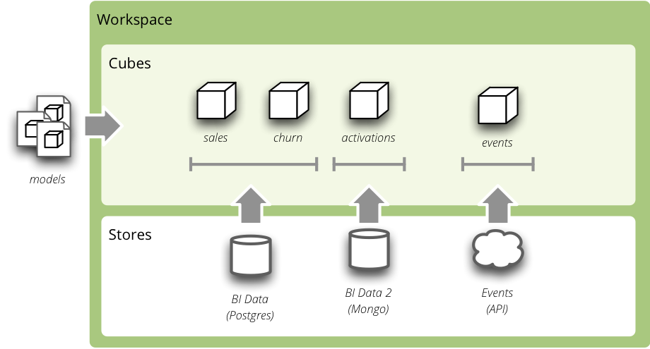

********
Tutorial
********

This chapter describes step-by-step how to use the Cubes. You will learn:

* model preparation
* measure aggregation
* drill-down through dimensions
* how to slice&dice the cube

The tutorial contains examples for both: standard tool use and Python use. You
don't need to know Python to follow this tutorial.

Data Preparation
================

The example data used are IBRD Balance Sheet taken from `The World Bank`_.
Backend used for the examples is ``sql.browser``.

.. _The World Bank: https://finances.worldbank.org/Accounting-and-Control/IBRD-Balance-Sheet-FY2010/e8yz-96c6

Create a tutorial directory and download :download:`IBRD_Balance_Sheet__FY2010.csv
<files/IBRD_Balance_Sheet__FY2010.csv>`.

Start with imports:

>>> from sqlalchemy import create_engine
>>> from cubes.tutorial.sql import create_table_from_csv

.. note::

    Cubes comes with tutorial helper methods in ``cubes.tutorial``. It is
    advised **not** to use them in production; they are provided just to
    simplify the tutorial.

Prepare the data using the tutorial helpers. This will create a table and
populate it with contents of the CSV file:

>>> engine = create_engine('sqlite:///data.sqlite')
... create_table_from_csv(engine,
...                       "IBRD_Balance_Sheet__FY2010.csv",
...                       table_name="ibrd_balance",
...                       fields=[
...                             ("category", "string"),
...                             ("category_label", "string"),
...                             ("subcategory", "string"),
...                             ("subcategory_label", "string"),
...                             ("line_item", "string"),
...                             ("year", "integer"),
...                             ("amount", "integer")],
...                       create_id=True
...                   )

Analytical Workspace
====================

Everything in Cubes happens in an `analytical workspace`. It contains cubes,
maintains connections to the data stores (with cube data), provides connection
to external cubes and more.

    Analytical workspace and it's content

The workspace properties are specified in a configuration file `slicer.ini`
(default name). First thing we have to do is to specify a data store –
the database containing the cube's data:

.. code-block:: ini

    [store]
    type: sql
    url: sqlite:///data.sqlite

In Python, a workspace can be configured using the `ini` configuration:

.. code-block:: python

    from cubes import Workspace

    workspace = Workspace(config="slicer.ini")

or programatically:

.. code-block:: python

    workspace = Workspace()
    workspace.register_default_store("sql", url="sqlite:///data.sqlite")

Model
-----

Download the :download:`tutorial model<files/tutorial_model.json>` and save it as
``tutorial_model.json``.

In the `slicer.ini` file specify the model:

.. code-block:: ini

    [workspace]
    model: tutorial_model.json

For more information about how to add more models to the workspace see
the :doc:`configuration documentation<configuration>`.

Equivalent in Python is:

>>> workspace.import_model("tutorial_model.json")

You might call :meth:`import_model()<cubes.Workspace.import_model>` with as many
models as you need. Only limitation is that the public cubes and public
dimensions should have unique names.

Aggregations
------------

Browser is an object that does the actual aggregations and other data queries
for a cube. To obtain one:

>>> browser = workspace.browser("ibrd_balance")

Compute the aggregate. Measure fields of :class:`~cubes.AggregationResult` have aggregation suffix. Also a total record
count within the cell is included as ``record_count``.

>>> result = browser.aggregate()
>>> result.summary["record_count"]
62
>>> result.summary["amount_sum"]
1116860

Now try some drill-down by `year` dimension:

>>> result = browser.aggregate(drilldown=["year"])
>>> for record in result:
...     print record
{u'record_count': 31, u'amount_sum': 550840, u'year': 2009}
{u'record_count': 31, u'amount_sum': 566020, u'year': 2010}

Drill-down by item category:

>>> result = browser.aggregate(drilldown=["item"])
>>> for record in result:
...     print record
{u'item.category': u'a', u'item.category_label': u'Assets', u'record_count': 32, u'amount_sum': 558430}
{u'item.category': u'e', u'item.category_label': u'Equity', u'record_count': 8, u'amount_sum': 77592}
{u'item.category': u'l', u'item.category_label': u'Liabilities', u'record_count': 22, u'amount_sum': 480838}
